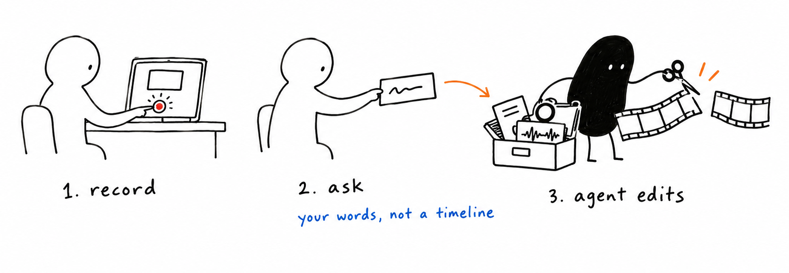
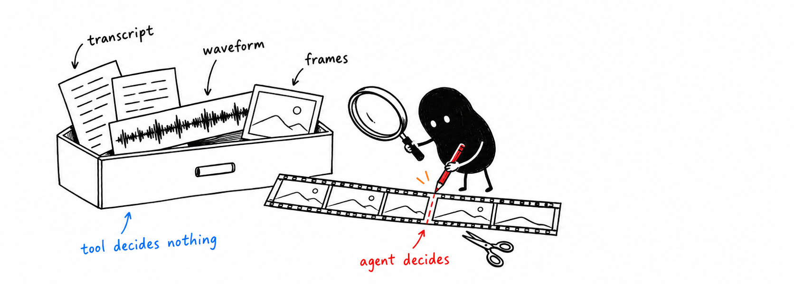
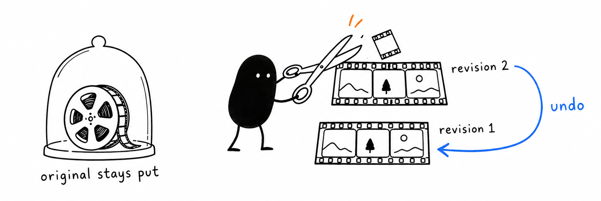

<p align="center">
  
</p>

<p align="center">
  <a href="https://github.com/dzhng/yap/releases/latest"></a>
  
  
  
</p>

---

**Yap is a tool your AI agent uses to help you communicate.**

Some ideas are faster to show than to write: a bug you can see, a product you
want to demo, an update for your team, a story for your podcast. With Yap you
just talk and show. Record your screen or camera, or drop in any video, and say
it however it comes out. Your agent turns it into what you meant.

Screen recording, transcripts, video editing and audio cleanup all serve that one
job: getting your ideas across clearly. Yap gives **Claude Code, Codex, or any
agent harness** the eyes, ears and hands to work with video. Your agent decides
what makes your point land.

**Just yap. Your agent makes it a great video.**

**[Get started →](#get-started)** Your agent can install it for you.

## Communication in both directions

**Show your agent.** Instead of typing three paragraphs about a bug or a design,
record it and talk. Your agent sees what was on screen at the exact moment you
said "this", hears what you meant, and acts on it.

**Get your point across.** When the audience is people, your agent turns your
rough take into something worth their time: cut to the point, captioned, cleaned
up and in the right format for where it's going.

## What people make with it

- **Messages for coworkers.** Async updates, walkthroughs and code-review
  narrations that come back tight, with chapters, a summary and captions.
- **Bug reports and feedback for your agent.** "Watch me do this" becomes
  instructions your agent can follow.
- **Launch and demo videos.** One take of you showing the product becomes a
  polished demo, cut per audience or per platform.
- **Podcasts and talks.** Clean audio, consistent loudness, highlight clips with
  captions, and transcripts your agent can turn into show notes or a post.
- **You, at your best.** Rehearse a pitch and get evidence on pacing and filler
  words, keep your best take, or fix a misspoken word in your own voice.

The full picture, including what's possible today and what isn't yet, is in
[positioning](positioning.md).

## How it works

<p align="center">
  
</p>

1. **Yap.** Record from the menu bar (screen, microphone, system audio and an
   optional camera), let your agent start a recording, or hand it a video you
   already have.
2. **Ask** your agent in plain words, for example "Cut this into a tight 60-second
   demo with captions" or "Here's the bug, fix it." Attach a reference video if you
   have a style in mind.
3. **Your agent makes it clear.** It reads the transcript, looks at the frames and
   listens to the audio to understand what you said. Then it acts on it, or cuts
   around the stumbles, adds what you asked for, reviews the result and exports
   the final video.

Don't like a choice? Say so in one more sentence. Every edit is a revision you
can undo.

## Things you can ask for

> "Watch this recording of the checkout bug and fix it."

> "Tighten this into a 60-second product demo. Cut the dead air and false starts."

> "Make a vertical version for X with big, punchy captions."

> "Here's a launch video I love. Match its pacing and caption style."

> "I said 'version three' at 0:42 but meant 'version two'. Fix it in my voice."

> "Zoom in when I open the settings panel, fade out at the end, export 1080p."

> "Clean up the background hum and give me an M4A of just the narration."

> "I practised my pitch on camera. How's my pacing, and where did I ramble?"

> "Turn yesterday's podcast episode into three captioned clips and show notes."

> "Make a two-minute update for my team from this recording, with a summary."

## What your agent gets

<p align="center">
  
</p>

Every capability is there to help the message land. Yap itself makes **zero
editorial decisions** and has no built-in agent; your agent makes them all. Yap
hands it evidence about what you said and showed, plus precise operations, so the
result follows your intent instead of a built-in house style.

| | What your agent can use |
| --- | --- |
| **See and hear** | Local transcription with word timings and search, frames and storyboards, waveforms and spectrograms, scene and cursor events, speaker turns, loudness measurement |
| **Cut and arrange** | Multi-range cuts, takes from several recordings, layers and picture-in-picture, canvas and aspect changes, retiming, undo and history |
| **Polish** | Captions seeded from the transcript in your own fonts, zoom and crop, fades and gain curves, noise reduction, music and room tone |
| **Fix a word** | Regenerate a misspoken phrase in the speaker's own voice with a local model |
| **Deliver** | MP4 video, WAV or M4A audio, SRT/VTT captions, and editable project packages |

Everything runs on your Mac. Recordings, transcripts and voice models stay local.

## Your originals are never touched

<p align="center">
  
</p>

Edits are non-destructive. The agent works on revisions of a project, and the
source recording stays byte-for-byte as you captured it. Any revision can be
previewed, compared, undone or restored, so letting an agent edit carries no risk.

## Get started

Requires **Apple Silicon and macOS 26 or newer**.

The zero-effort route is to let your agent install it. Open Claude Code or Codex
and say:

> Install the yap skill and the Yap app by following
> https://github.com/dzhng/yap#agent-setup

Then record something and ask for the video you want.

Prefer doing it by hand? Follow [agent setup](#agent-setup) below. It takes a few
minutes.

## Agent setup

These steps are written for the agent doing the install, so they're precise.
Linux containers can exercise the portable CLI contracts but cannot run the native
app or capture macOS media.

### 1. Install the yap skill

Install the complete [consumer skill](skills/yap) for the whole computer by
default. If the user explicitly requests a project install, use that project.
If scope is unspecified and the current directory looks like a project, ask
whether to install for **this project or the whole computer** before writing.
Being inside this repository does not itself authorize a project-local install.

[Skill lifecycle](skills/yap/references/skill-lifecycle.md) owns pinned acquisition,
installation, path/link verification and explicit refresh. Repository
`.agents/skills` are development procedures; `skills/yap` is the consumer source.
The installer requires Node/npm and `npx` separately from the app's bundled Node.

From a checkout, use the absolute path to its consumer folder. For the whole
computer (the default):

```sh
npx --yes skills@1.7.0 add /absolute/path/to/yap/skills/yap \
  --skill yap --agent codex claude-code --global --yes
```

For an explicitly selected project, run from that project's root without
`--global`:

```sh
npx --yes skills@1.7.0 add /absolute/path/to/yap/skills/yap \
  --skill yap --agent codex claude-code --yes
```

Inspect existing destinations first and verify the full folder and discovery
links afterward, following the lifecycle reference. Start a fresh agent session
and confirm discovery (`$yap` for Codex, `/yap` for Claude). App updates never edit
skill files.

### 2. Install the app and CLI from the latest release

Use the [latest stable GitHub release](https://github.com/dzhng/yap/releases/latest),
not a source build. Download its `Yap-<tag>-macos-arm64.zip`,
`release.json` and `SHA256SUMS` together. In the download directory, run
`shasum -a 256 -c SHA256SUMS` before extracting. Check the receipt's architecture,
minimum macOS version and signing status.

Extract the ZIP with `ditto -x -k <zip-path> <new-directory>`. Install its
`Yap.app` at `~/Applications/Yap.app` and its `yap`
launcher at `~/.local/bin/yap`; make the launcher executable and add
`~/.local/bin` to PATH. Quit and back up an existing installation before replacing
it. Node is bundled; consumers do not need Bun, Node or Swift installed separately.

The skill's [installation procedure](skills/yap/references/installation.md)
contains executable download/install commands and upgrade, app-location and
macOS launch guidance. Check the receipt's signing status; releases are not notarized.
If blocked, the user must approve **Open Anyway** in System Settings → Privacy &
Security. Installation does not grant capture permissions. When a first-class Yap
speech feature is used, its registered pinned model/runtime is prepared automatically;
external models remain recommendation-only.

### 3. Verify before operating

```sh
yap capture.status --help
yap service.health
```

Operation help returns its schema without launching the app. `service.health`
checks the installed runtime and may launch the app's local service; it does not
start recording. Save `yap --help` to a file when discovering operation names,
then request help for only the operation you need. Parse each operation's JSON
envelope, including failures; a successful request can still describe pending or
failed background work. Follow the skill for pinned revisions, retry identities
and verification of delivered media.

## Releases

Download the app from [GitHub Releases](https://github.com/dzhng/yap/releases).
The [release notes](scripts/release-notes.md) describe release limitations and
link to agent setup. Built binaries are release assets;
source control retains their reproducible inputs rather than generated app bundles.

Version tags trigger a verified GitHub release. The [build and release guide](scripts/README.md)
explains version ownership, CI hooks and personal source installs.

## Contributing

### Product boundary

**This project makes zero editorial decisions. It only provides primitives.**
Recording, transcription, search and detection supply evidence. The caller (your
agent) decides what to change and submits explicit operations. Defaults fill
parameters within a requested operation; they never authorize another treatment
or an automatic edit. Original media remains intact.

Development verifies those primitives with explicit fixture operations. A user's
recording is reusable test input, not an invitation to edit it or ask its owner
for personal keep/remove judgments.

### Where things belong

- [Native app](apps/macos/README.md): recording controls and the service child's lifetime.
- [Service](apps/service/README.md): composition of domain owners, native work and public delivery.
- [CLI/MCP](apps/cli/README.md): adapters over the [shared protocol](packages/protocol/README.md)
  and [local client](packages/client/README.md).
- [Core](packages/core/README.md): immutable assets, acquisitions, revisions, jobs and publication.
- [Composition](packages/composition/README.md): pure authoring, exact clocks and compiled plans.
- [Native media](helpers/mac/README.md): capture, physical sample support and plan execution.
  The [prepared voice worker](helpers/voice/README.md) executes the separately owned
  local inference runtime.
  The [FFmpeg dependency owner](helpers/ffmpeg/README.md) prepares relocatable
  media tools and their redistribution inputs.
  [Optional runtime assembly](helpers/model-runtime/README.md) preserves local
  dependency layers; the [speaker primitive](helpers/speaker/README.md) supplies anonymous source
  observations through explicit optional model/runtime preparation and shared
  retained-evidence owners.
  The [conditional alignment worker](helpers/alignment/README.md) preserves the
  supplied-text interpretation and full native operands of its pinned provider.

The consumer [yap skill](skills/yap/SKILL.md) teaches external agents
how to edit for the user with the toolkit. Repository development skills live
separately under .agents/skills; they are not a product operation catalog.
README artwork lives in [.github/readme](.github/readme).

### Development and evidence

Follow [the working principles](AGENTS.md). The [root manifest](package.json)
owns build and check commands; package manifests own narrower checks and dependencies.
The [build guide](scripts/README.md) explains native prerequisites and why building,
installing and packaging are separate actions.

### Build from source on macOS

Source builds target Apple Silicon on macOS 26 or newer. Install Xcode (including
the macOS SDK and command-line tools), Bun at the version pinned in
`package.json`, and Node at the version in `.node-version`. From the repository
root, run:

```sh
export DEVELOPER_DIR=/Applications/Xcode.app/Contents/Developer
bun install --frozen-lockfile
node scripts/release.mjs prepare
bun run build
```

`release.mjs prepare` downloads and verifies the pinned build inputs, prepares
FFmpeg and the denoiser, and builds the pinned Sparkle framework into
`dist/sparkle`. The same step repairs a fresh checkout; no manually installed
Sparkle framework or Homebrew packages are required. Release signing needs the
separate credentials described in [the release guide](scripts/README.md).

For focused checks, use the package commands in the owning manifests. The full
macOS app check also needs the native SDK and the prepared Sparkle framework;
portable CLI tests do not prove that native build.

[Verification tools](packages/test-harness/README.md) explain how to reuse existing
fixtures, integration journeys and research. The [fixture guide](fixtures/README.md)
explains retained media and original-byte authority; the [workbench](apps/workbench/README.md)
is a capture target, not an editing interface.

[Agent evaluations](evals/README.md) run the consumer skill in disposable Docker
containers with separate response grading. They complement native/media proof;
portable CLI checks do not establish macOS capture readiness.

[Specs and evidence](specs/README.md) separate future proposals, closed rationale
and historical observations. Current behavior comes from the owning code and
its README. A historical pass is scoped evidence, and an unchecked old plan is
not an active implementation request.
