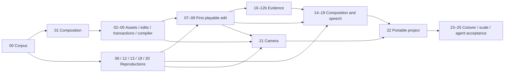

# Agent-operated video editing

Status: implementation in progress; assets and shared preparation jobs verified in the isolated service, structural edits underway. Updated 2026-09-27.
The [product CLI skill](../../skills/screenrec/SKILL.md) documents current public
capabilities only. This plan supersedes the discovery map's operational queue;
the [map](MAP.md) remains the record of user intent.

## Next Agent Prompt

Implement the full local agent-operated editor. Read [contracts](contracts.md),
[architecture](architecture.md), [verification](verification.md) and
[research](research.md). Continue [03 — edits](slices/03-edits.md): exact splitting,
attachment partitioning, removal/trim, explicit removal ripple, non-ripple move
with track destinations, detach/reanchor, duplication, non-ripple retime and
batch labels pass. Next implement insertion, then ripple move/retime and
replacement. Preserve the accepted
[03a exact-boundary model](slices/03a-exact-edit-boundaries.md). Durable projects
[04](slices/04-projects.md) and compilation [05](slices/05-compiler.md) follow the
completed reducer; the first public editing checkpoint remains [09](slices/09-first-preview.md).

Assets [02](slices/02-assets.md) and shared jobs [02a](slices/02a-preparation-jobs.md)
are integrated in the isolated service. Import identity and job admission commit
together, and provenance is paginated separately from immutable metadata. Keep
installed recording behavior isolated until the planned cutover.

Research gates remain open: [06](slices/06-render-reproduction.md) has an independently
reviewed temporal mechanism and tested Rec.709 conversion; general encoding
quality and broader color coverage remain open;
[12](slices/12-speech-evidence.md) reproduces the failing timing baseline;
[13a](slices/13a-stretch-endpoints.md) has corrected numerical support evidence but
needs protected-word/listening and short-duration policy acceptance; and
[18](slices/18-voice-reproduction.md) runs offline with a passing independent ASR word check, but still needs identity,
delivery and join acceptance. Do not adopt numerical success as speech-quality proof. Camera
[20](slices/20-camera-reproduction.md) is still unstarted.

Current evidence:

- [00 baseline](assets/00-baseline/manifest.json): corpus five checks, core 39;
  native initial 53/55 with two performance timeouts retained as red evidence.
  [Thumbnail](assets/00-baseline/thumbnail-fix/review.md) and
  [audio](assets/00-baseline/audio-fix/review.md) fixes pass their affected gates
  in the main worktree without changing thresholds. The separate 300-second
  audio scale deadline remains open under [24](slices/24-scale.md).
- [01 composition](assets/01-composition/review.md): build, type checks, 16 tests
  and independent corpus probe pass. Commit `b1b08f3` owns the pure model.
- [02 catalog](assets/02-catalog/review.md): shared connection extraction passes
  67 library/job tests and service type checking.
- [02 native probe](assets/02-probe/review.md): seven worker checks pass, including
  stream offsets and B-frame edit lists. Asset admission is integrated in the
  isolated service; installed production cutover remains pending.
- [03a exact boundaries](assets/03a-boundaries/review.md): 19 composition tests
  and corpus probe pass; split preservation is falsified by a rounding mutation.
- [03 edits](assets/03-edits/retime/tests.txt): 50 tests, 595 retimed removal and
  ripple cases each, plus 1,326 exact split cases pass; independent reviews caught and verified the
  selected-member link fix.
- [Integration](assets/integration/README.md): native asset and CLI/MCP gates pass.
  Broad preservation is 515/516 under concurrent work; the unchanged storage
  suite passes 13/13 in isolation. The concurrent deadline remains recorded.
- [06 render](assets/06-render/report.json): nine frozen cases and 70 output hashes;
  independent review accepts demonstrated timing. [Rec.709 evidence](assets/06-rec709/README.md)
  verifies profile conversion on the tested frames; encoding loss remains explicit.
- [12 speech](assets/12-speech/README.md): 15 independent timing marks still fail
  the existing gate; full semantic labels remain incomplete.
- [13a support](assets/13a-support-review/README.md): corrected whole-output
  measurements preserve candidate bytes; speech-quality acceptance remains open.
- [18 voice](assets/18-voice/README.md): six offline generations, exact PCM splice
  checks; [ASR word agreement](assets/18-voice-lexical/README.md) passes. The
  user finds voice close but joins wrong and generated speech louder.
  [Tighter-join auditions](assets/18-voice-joins/README.md) and an alternative
  conditioning mode address follow-up reports of excess pauses and echo;
  original context remains exact, but acoustic quality remains unverified.

Keep old media intact and develop against isolated homes; the new library is
fresh, with no history migration or compatibility engine. No voice model/runtime
winner has been accepted. Complete speech labels and physical/listening acceptance
remain explicit gates. Do not ask again about settled UI, creative policies,
voice references or migration decisions.

For each committed pass, update its slice evidence and this pickup, audit choices,
and keep the product skill synchronized only with shipped public operations.
Check only completed contracts below; the plan itself is not runtime proof.

## Outcome and boundaries

The user can ask an external agent to create a screen/webcam tutorial from several
takes and imported footage: remove mistakes, audible fillers and accidental word
repetitions; slow rushed passages; insert or overlap footage; replace video while
keeping sound or vice versa; add music, text, captions and keyframed zooms; generate
replacement words from selected local reference audio; verify and export a local
video and portable editable project at requested dimensions.

CLI is primary; MCP exposes exactly the same operations. Commands edit a managed
project in atomic, undoable, revision-bound batches. General composition/keyframe
primitives underlie convenience commands. All media and inference remain local
after explicit model preparation. The agent chooses wording, references, pacing,
B-roll, layouts, ducking and other creative decisions. The engine provides evidence
and precise operations. References may come from current footage, any admitted
local audio/video, or past projects; no required voice enrollment.

No editing GUI, hosted sharing, embedded editorial assistant, lip-sync generation,
old-history migration, or mandatory draft approval is in this release. Existing
menu-bar capture controls remain. A verification workbench/probe is not a product
editing UI. Broad professional-editor parity beyond this named workflow is not
implied; capabilities stay extensible through the one typed composition model.

## Roadmap to review

| Checkpoint | What becomes usable | Owning slices |
| --- | --- | --- |
| Prove the risky mechanisms | Frozen media/voice/stretch experiments and exact timing contract | 00–01, 06, 12, 13, 18, 20 |
| First working edit | Import two clips, independently replace audio/video, undo, preview and export | 02–09 |
| Give agents reliable evidence | Every repeated/reordered word/event, waveform/spectrogram, full audio delivery, verified cleanup pipeline | 10–12b |
| Full composition | Retiming, presenter layers, pointer geometry, keyframes, captions and local generated speech | 14–19 |
| Record and carry projects | Separate synchronized webcam, durable dependencies and editable relocated packages | 20–22 |
| One production engine | Cutover with preservation parity, scale checks and autonomous real-agent acceptance | 23–25 |

Numbers identify contracts, not a mandatory serial order. Dependencies in each
slice are authoritative. Research branches run early, with production adoption
only after their recorded gates pass.

The diagram groups branches for readability; it does not imply that voice/camera
research blocks the first preview. Individual dependency lists are checked for cycles.

## Global checklist

- [x] [00 — Freeze fixtures and preservation evidence](slices/00-corpus.md)
- [x] [01 — Composition identity and time](slices/01-composition.md)
- [x] [02a — Shared durable preparation targets](slices/02a-preparation-jobs.md)
- [x] [02 — Immutable asset admission](slices/02-assets.md)
- [x] [03a — Preserve exact edit boundaries](slices/03a-exact-edit-boundaries.md)
- [ ] [03 — Structural edits and attachments](slices/03-edits.md)
- [ ] [04 — Durable projects and shared commands](slices/04-projects.md)
- [ ] [05 — Compile bounded execution plans](slices/05-compiler.md)
- [ ] [06 — Reproduce native multi-source rendering](slices/06-render-reproduction.md)
- [ ] [07 — Execute video plans](slices/07-video-execution.md)
- [ ] [08 — Independent audio mixing](slices/08-audio-mixing.md)
- [ ] [09 — First public preview and export](slices/09-first-preview.md)
- [ ] [10 — Occurrence-aware inspection](slices/10-project-evidence.md)
- [ ] [11 — Audio, waveforms and spectrograms](slices/11-audio-inspection.md)
- [ ] [12 — Validate speech cleanup evidence](slices/12-speech-evidence.md)
- [ ] [12b — Adopt verified source speech processing](slices/12b-speech-processing.md)
- [ ] [13 — Reproduce pitch-preserving stretch](slices/13-stretch-reproduction.md)
- [ ] [13a — Preserve selected speech at stretch endpoints](slices/13a-stretch-endpoints.md)
- [ ] [14 — Integrate independent and linked retiming](slices/14-retiming.md)
- [ ] [15 — Layers, crop and pointer geometry](slices/15-layer-geometry.md)
- [ ] [16 — Keyframes and convenience zooms](slices/16-keyframes.md)
- [ ] [17 — Text and attached captions](slices/17-text-captions.md)
- [ ] [18 — Reproduce local reference speech](slices/18-voice-reproduction.md)
- [ ] [19 — Durable local generation and replacement](slices/19-voice-assets.md)
- [ ] [20 — Prove screen and camera timing](slices/20-camera-reproduction.md)
- [ ] [21 — Integrate synchronized webcam capture](slices/21-webcam.md)
- [ ] [22 — Relocatable editable projects](slices/22-portable-projects.md)
- [ ] [23 — Cut over all consumers and remove old owners](slices/23-cutover.md)
- [ ] [24 — Verify bounded work and long projects](slices/24-scale.md)
- [ ] [25 — Autonomous agent acceptance](slices/25-agent-acceptance.md)

## Review and invariants

- [Contracts](contracts.md) fixes time domains, identity, edit/ripple/link/anchor
  behavior, project storage, inspection and output semantics. New choices require
  an explicit spec update, not an unrecorded implementer guess.
- [Architecture](architecture.md) gives each concept one owner. A temporary
  development boundary is removed in slice 23; no compatibility wrapper survives.
  Preview/export compile the same document. Generated/imported/captured assets
  share ownership and lifecycle.
- [Verification](verification.md) owns preservation, real-audio, scale and agent
  gates. Visual slices explicitly run compare-screenshots against references,
  then unprimed screenshot-critique as the last visual check. Non-blocking review
  uses preview-shots; silence cannot satisfy missing physical/listening evidence.
- [Research](research.md) records primary sources and freezes accepted experiments
  before their adoption. Research failure leaves the feature incomplete and
  triggers its named alternative/reslice, not a passing mock.
- [Implementation choices](choices.md) records decisions made in implementation
  where the plan was silent.
- [Planning decisions](decisions.md) records independent-draft synthesis,
  architectural choices and recursive splitting. It is disclosure, not another
  task list.

Human review surfaces are CLI JSON/diffs, bounded images, playable local clips and
reports. Every slice names a runnable probe created by that slice, a verdict,
its allowed implementation discretion and the feedback that would change it.
No milestone depends on a finished editor GUI.

## Validation of this plan

Planning validation consists of three independent whole-plan drafts (fewest-slices
Codex, risk-first Claude, seam-quality Claude), primary-source research, ownership
and contract review, a dependency/link/required-section audit, and scrollback
reconciliation. No new rendering, voice quality, webcam or performance gate is
claimed passed by planning validation. Implementation evidence lives in the
current handoff and owning slices.

The [original planning report](assets/planning/validation.json) freezes the original
27-slice graph. The [maintenance validation](assets/planning/maintenance.json)
checks the expanded graph and local links after implementation reslicing. These
document checks are distinct from runtime acceptance.
