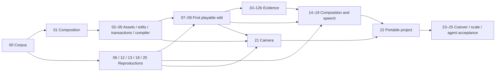

# Agent-operated video editing

Status: implementation spec complete; implementation not started. Updated 2026-09-27.
The [product CLI skill](../../skills/screenrec/SKILL.md) exists for current capabilities;
it is not evidence that the new editor exists. This plan supersedes the discovery
map's research queue and kickoff prompt. The [map](MAP.md) remains the record of
user intent.

## Next Agent Prompt

You are implementing the user's local agent-operated editor. Read
[contracts](contracts.md), [architecture](architecture.md), [verification](verification.md)
and [research](research.md). Start at [00 — fixtures and preservation](slices/00-corpus.md).
Produce its reproducible corpus and actual baseline evidence before changing
production code. Do not ask the user again about scope, UI, creative policies,
voice references or migration; those decisions are settled.

After 00, run the dependency-ready research gates 06 (rendering), 12 (speech
inspection), 13 (stretch), 18 (voice) and 20 (camera clock), alongside the pure
composition and asset work. Gate 06 also needs 01. Do not start dependent
integration on assumed results. The first useful public checkpoint is
[09 — two clips, independent AV replacement, undo, preview and export](slices/09-first-preview.md).
A model download or missing physical camera evidence need not block that checkpoint.

No model/runtime winner has been measured yet. Source word timing is known to
miss the old target, and the previous release has physical/listening acceptance
still open. These are explicit gates, not permission to lower scope. Use isolated
harness homes and preserve old media. The new production library starts fresh;
there is no history migration or compatibility engine.

For each pass, update the owning slice Status line with evidence and limitations,
check only genuinely completed items below, and replace this pickup with the exact
next dependency-ready work. Keep the product skill synchronized only with shipped,
verified operations. Reslice newly discovered broad work before widening a patch.
Run the repository's implementation/review skills at implementation time; this
spec-writing pass has not run runtime acceptance.

## Outcome and boundaries

The user can ask an external agent to create a screen/webcam tutorial from several
takes and imported footage: remove mistakes, audible fillers and accidental word
repetitions; slow rushed passages; insert or overlap footage; replace video while
keeping sound or vice versa; add music, text, captions and keyframed zooms; generate
replacement words from selected local reference audio; verify and export a local
video and portable editable project at requested dimensions.

CLI is primary; MCP exposes exactly the same operations. Commands edit a managed
project in atomic, undoable, revision-bound batches. General composition/keyframe
primitives underlie convenience commands. All media and inference remain local
after explicit model preparation. The agent chooses wording, references, pacing,
B-roll, layouts, ducking and other creative decisions. The engine provides evidence
and precise operations. References may come from current footage, any admitted
local audio/video, or past projects; no required voice enrollment.

No editing GUI, hosted sharing, embedded editorial assistant, lip-sync generation,
old-history migration, or mandatory draft approval is in this release. Existing
menu-bar capture controls remain. A verification workbench/probe is not a product
editing UI. Broad professional-editor parity beyond this named workflow is not
implied; capabilities stay extensible through the one typed composition model.

## Roadmap to review

| Checkpoint | What becomes usable | Owning slices |
| --- | --- | --- |
| Prove the risky mechanisms | Frozen media/voice/stretch experiments and exact timing contract | 00–01, 06, 12, 13, 18, 20 |
| First working edit | Import two clips, independently replace audio/video, undo, preview and export | 02–09 |
| Give agents reliable evidence | Every repeated/reordered word/event, waveform/spectrogram, full audio delivery, verified cleanup pipeline | 10–12b |
| Full composition | Retiming, presenter layers, pointer geometry, keyframes, captions and local generated speech | 14–19 |
| Record and carry projects | Separate synchronized webcam, durable dependencies and editable relocated packages | 20–22 |
| One production engine | Cutover with preservation parity, scale checks and autonomous real-agent acceptance | 23–25 |

Numbers identify contracts, not a mandatory serial order. Dependencies in each
slice are authoritative. Research branches run early, with production adoption
only after their recorded gates pass.

The diagram groups branches for readability; it does not imply that voice/camera
research blocks the first preview. Individual dependency lists are checked for cycles.

## Global checklist

- [ ] [00 — Freeze fixtures and preservation evidence](slices/00-corpus.md)
- [ ] [01 — Composition identity and time](slices/01-composition.md)
- [ ] [02 — Immutable asset admission](slices/02-assets.md)
- [ ] [03 — Structural edits and attachments](slices/03-edits.md)
- [ ] [04 — Durable projects and shared commands](slices/04-projects.md)
- [ ] [05 — Compile bounded execution plans](slices/05-compiler.md)
- [ ] [06 — Reproduce native multi-source rendering](slices/06-render-reproduction.md)
- [ ] [07 — Execute video plans](slices/07-video-execution.md)
- [ ] [08 — Independent audio mixing](slices/08-audio-mixing.md)
- [ ] [09 — First public preview and export](slices/09-first-preview.md)
- [ ] [10 — Occurrence-aware inspection](slices/10-project-evidence.md)
- [ ] [11 — Audio, waveforms and spectrograms](slices/11-audio-inspection.md)
- [ ] [12 — Validate speech cleanup evidence](slices/12-speech-evidence.md)
- [ ] [12b — Adopt verified source speech processing](slices/12b-speech-processing.md)
- [ ] [13 — Reproduce pitch-preserving stretch](slices/13-stretch-reproduction.md)
- [ ] [14 — Integrate independent and linked retiming](slices/14-retiming.md)
- [ ] [15 — Layers, crop and pointer geometry](slices/15-layer-geometry.md)
- [ ] [16 — Keyframes and convenience zooms](slices/16-keyframes.md)
- [ ] [17 — Text and attached captions](slices/17-text-captions.md)
- [ ] [18 — Reproduce local reference speech](slices/18-voice-reproduction.md)
- [ ] [19 — Durable local generation and replacement](slices/19-voice-assets.md)
- [ ] [20 — Prove screen and camera timing](slices/20-camera-reproduction.md)
- [ ] [21 — Integrate synchronized webcam capture](slices/21-webcam.md)
- [ ] [22 — Relocatable editable projects](slices/22-portable-projects.md)
- [ ] [23 — Cut over all consumers and remove old owners](slices/23-cutover.md)
- [ ] [24 — Verify bounded work and long projects](slices/24-scale.md)
- [ ] [25 — Autonomous agent acceptance](slices/25-agent-acceptance.md)

## Review and invariants

- [Contracts](contracts.md) fixes time domains, identity, edit/ripple/link/anchor
  behavior, project storage, inspection and output semantics. New choices require
  an explicit spec update, not an unrecorded implementer guess.
- [Architecture](architecture.md) gives each concept one owner. A temporary
  development boundary is removed in slice 23; no compatibility wrapper survives.
  Preview/export compile the same document. Generated/imported/captured assets
  share ownership and lifecycle.
- [Verification](verification.md) owns preservation, real-audio, scale and agent
  gates. Visual slices explicitly run compare-screenshots against references,
  then unprimed screenshot-critique as the last visual check. Non-blocking review
  uses preview-shots; silence cannot satisfy missing physical/listening evidence.
- [Research](research.md) records primary sources and freezes accepted experiments
  before their adoption. Research failure leaves the feature incomplete and
  triggers its named alternative/reslice, not a passing mock.
- [Planning decisions](decisions.md) records independent-draft synthesis,
  architectural choices and recursive splitting. It is disclosure, not another
  task list.

Human review surfaces are CLI JSON/diffs, bounded images, playable local clips and
reports. Every slice names a runnable probe created by that slice, a verdict,
its allowed implementation discretion and the feedback that would change it.
No milestone depends on a finished editor GUI.

## Validation of this plan

Planning validation consists of three independent whole-plan drafts (fewest-slices
Codex, risk-first Claude, seam-quality Claude), primary-source research, ownership
and contract review, a dependency/link/required-section audit, and scrollback
reconciliation. No new rendering, voice quality, webcam or performance gate is
claimed passed. The next pickup remains slice 00.

The [planning validation report](assets/planning/validation.json) records 27 slices,
59 dependency edges, valid local file links and no dependency cycles. It explicitly
distinguishes these document checks from runtime acceptance.
