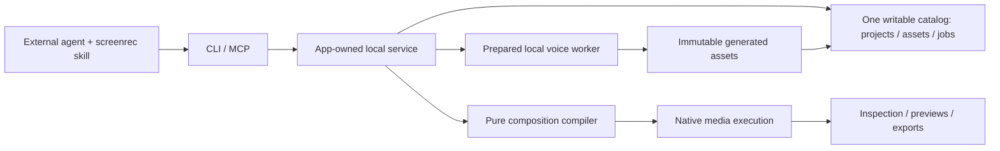

# Ownership and cutover

## End state

The local app owns the service. CLI and MCP call one operation registry. The
service coordinates durable project/asset/job owners; one pure composition
package determines all editorial meaning. Native workers execute media plans.
An external agent provides editorial intelligence and chooses reference audio.

## One owner per concept

| Concept | Owner | Consumers and boundary |
| --- | --- | --- |
| Composition, time maps, anchors, edit algebra, curve compilation | New `packages/composition` (`@screenrec/composition`) | Pure TypeScript; no filesystem, database or native calls. Protocol imports its serializable schemas. Service calls the reducer/compiler. |
| Asset admission, immutable identity, dependencies and leases | Focused asset modules in `packages/core` | Service handles local paths and worker probing. Composition sees metadata/IDs only. Capture and generation publish through the same asset boundary. |
| Project revisions, transaction/replay/undo | Focused project store modules in `packages/core` | Reuse the proven transaction pattern from `library.ts`; one catalog/connection owner, not one DB per subsystem. Store calls the pure reducer. |
| Source evidence generations | Existing processing/evidence owners refactored to asset/stream identities | Preserve acquired data, timing and provenance. Project projections are separate reads through the composition mapping, never rewritten source evidence. |
| Job admission, cancellation, restart and publication | Existing core jobs + service coordination | Generalize target identity once to assets/projects; do not create separate preview, TTS and export queue implementations. |
| Render semantics | Composition compiler | Supplies resolved frame schedules, audio placements and compiled effects. No native second interpretation of editorial commands. |
| Decode, pixel execution, PCM processing, encode | Swift targets under `helpers/mac` | Chosen mechanisms must pass reproduction gates. The same executor serves inspection, range previews and exports. |
| Local voice inference | Prepared, pinned worker selected by voice research | Sidecar process if MLX Audio Python wins; no cloud service, embedded editorial agent, or mandatory training. Same asset/job lifecycle as other processing. |
| Public schema and errors | `packages/protocol` | CLI/MCP derive help and validation from it; adapters only format and deliver. |
| Agent workflow | `skills/screenrec/SKILL.md` | Teaches capability discovery and evidence → edit → verify → export. No duplicate operation schema catalog in the skill. |
| Verification | `packages/test-harness/editing` + native test targets | CLI probes and media artifacts, not an editing GUI. Feature-owned evidence stays under this spec's assets directory. |

Add the pure package because composition has an independently testable algebra
and multiple consumers. Keep I/O modules in the existing core/service; do not
invent an application per operation. Native wire envelopes are an external
boundary; code generation or a small typed bridge is allowed, but the wire must
not become another authoring model. No arbitrary `effects: any[]` escape hatch.

## Source preservation and fresh storage

The user chose no history migration. The new library uses
`SCREENREC_HOME/library/catalog.sqlite` and managed media under
`SCREENREC_HOME/library/`. This is one fresh writable catalog for the new app;
the prior catalog and media are left intact, never upgraded/deleted implicitly.
This path choice is a planning decision, not existing behavior.

Old source files can be explicitly imported as assets. Source capture journals
may be adopted by a bounded source-evidence importer when their identities and
media hashes validate; old edit histories are not interpreted. Explain the fresh
library when reporting the installation/cutover. Do not auto-scan a user's disk
or silently migrate all old recordings.

Before production cutover, develop against isolated harness homes. The app
continues its existing recording behavior while the new package and helpers are
tested; no production feature flag routes the same edit between engines.

## Short-lived development boundary

During slices 01–22, the new project path and the old recording path can exist
only as an explicitly temporary development boundary. Harnesses can exercise the
new project registry through an isolated service. The installed user-facing
release is not declared complete at this stage. There is no legacy-to-project
translation wrapper or alias protocol.

Slice 23 is the cutover/removal owner. It changes capture finalization to publish
assets and a project, routes inspection/render/export through the new owners,
updates app/CLI/skill consumers, and removes the span revision interpreter,
fixed-role movie request, fixed-role package reader and old editing operations.
Source capture, recovery, cursor sampling and source-evidence components survive
as source mechanisms. Refactor mixed modules to remove obsolete responsibilities
instead of deleting useful low-level primitives merely because of a filename.

The cutover cannot land before inspection, pointer presentation, package export
and the matched-input preservation gates work through the new path. Original
schema-shape tests can change; fidelity and concurrency guarantees cannot vanish.
No old-history support is hidden inside an importer. When slices 01–22 finish,
the temporary boundary has an immediate removal point, not indefinite coexistence.

## Resource model

Compile and execute requested windows with bounded schedules. Use a reusable
interval index over immutable revisions; do not walk an entire two-hour movie to
serve a two-second preview. Cache source decode/transcription by asset generation
and rendering by composition/dependency/settings identity. No pre-render of every
frame and no eager Cartesian expansion of repeated clips × words × images.

Media/model jobs are background workers. Limit concurrent heavy workers using
the shared job admission owner; capture gets priority over background exports.
Every loop advances a cursor/sample/frame or ends with a typed failure. Retries
have explicit ownership and budgets; unchanged polling does not requeue work.
Record queue wait separately from execution latency.

Assets/jobs/revisions/exports retain dependencies explicitly. Deletion checks
actual references and active leases; derived-cache eviction never destroys
original or generated media. No new periodic janitor without a demonstrated
lifecycle requirement; reuse startup recovery and explicit storage cleanup.
