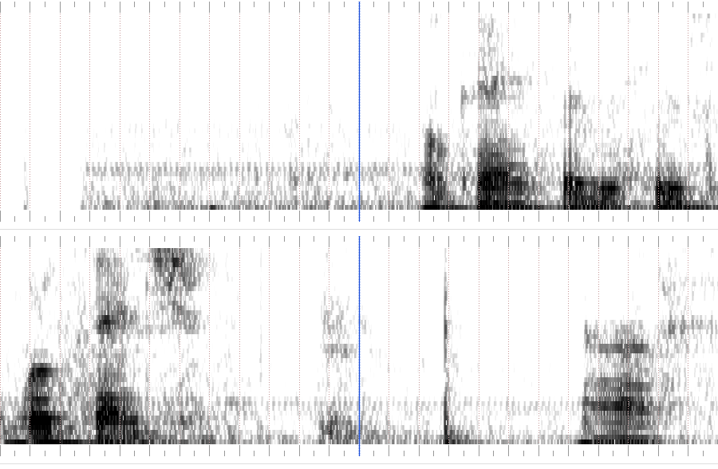

# Workbench boundary context

The earlier narrow panel excludes both alternative word-end predictions. This
wider view preserves the original recording and unresolved independent mark;
its purpose is to expose the missing acoustic context, not choose a word endpoint.



The lower panel concerns “workbench”; the blue reference is 5.648675 seconds in
source time. [Metadata](panel-metadata.json) and [comparison](comparison.json)
provide the scale the raster itself does not label. At 900 pixels wide:

| Point | Source seconds | Original panel x | Wider panel x |
| --- | ---: | ---: | ---: |
| Alignment end proposal | 5.088675 | −110 (outside) | 240 |
| Verbatim end proposal | 5.108675 | −90 (outside) | 247.5 |
| Existing unresolved mark | 5.643675 | 445 | 448.125 |

Fresh unprimed visual review inspected both complete images. It judged the wider
framing better for including all three points, while identifying a 2.67× loss of
local time detail and missing numbered ticks, units, frequency scale and legend.
Accordingly this is context evidence with the table/metadata, not a standalone
precision annotation surface. The 20 ms candidate separation is 7.5 pixels; the 5 ms
mark/reference gap is only 1.875 pixels. The original image remains preferable for
local texture where it contains the signal.

No endpoint, lexical identity, filler label or audible non-regression can be
established from this visual envelope. The original marks and score remain
unchanged. Independent audible review must resolve whether the later sound is
part of the word before a label can change. Slice 12 remains open.

Reproduce using the unchanged repository harness, writing to a fresh directory:

```sh
node packages/test-harness/speech-boundaries.mjs --transcript specs/agent-editing/assets/12-speech/transcript.json --out /tmp/screenrec-workbench-wide-rerun --panels 2 --window 2400
```

The [original panel](../../../recording-for-ai/assets/speech/boundaries/sheet-0.png)
and [text-only trial](../12-alignment-text-coverage/README.md) retain their separate
roles. Generation decodes the actual fixture PCM without speaker playback; no
model, production behavior or annotation was changed.

## Annotation integrity

The existing [boundary harness](../../../../packages/test-harness/speech-boundaries.mjs)
keeps a human mark at its absolute source time when a compatible candidate's
reported endpoint changes. Newly drawn packets bind narration bytes by SHA-256
and the acquired source-clock origin. A locator-only move preserves this identity.
Reuse also requires the same boundary ID, side and exact word text; dropping or
reassigning a marked boundary refuses before decoding or overwriting panels/marks.
No absent mark is inferred from a candidate.

An annotated legacy packet without bound source identity cannot safely be redrawn
in place. Use a fresh output directory, then explicitly rebind human annotations
only after independently checking their source and word identity. Existing
`--score` remains available on frozen legacy packets and does not redraw them.
The original committed marks, panels and scores are unchanged.

The [CLI regression](../../../../packages/test-harness/speech-boundaries.test.mjs)
uses the retained workbench numbers with synthetic rendering input, not new speech
ground truth. The mark stays at 5,643,675µs when the candidate endpoint moves from
5,648,675µs to 5,088,675µs: its displayed offset becomes +555ms instead of retaining
−5ms and silently moving the reference. The [original red](annotation-red.txt)
demonstrates that failure; the [green run](annotation-green.txt) includes unchanged
timestamp/pixel preservation, locator relocation, incompatible source/origin/word,
missing-boundary and unbound-legacy refusal, plus unchanged legacy scoring and the
existing scorer tests. Every refusal leaves existing panel and mark bytes intact.

This fixes evidence handling, not the actual frozen workbench dispute: those
historical marks did not undergo the incompatible redraw. Audible word identity,
independent labels and the failing timing gate remain unresolved. No model,
listening, capture, native build or new annotation was used.

Shape/diff/docs review retained the existing owner without a new annotation
registry or versioned schema. Formatter, lint and local-link checks pass.
[Independent Codex reviews](annotation-review.txt.gz) found no actionable regression
and reran the CLI regression successfully, including the streaming-hash follow-up. This pass changes annotation metadata
handling; it does not change spectrogram rendering or claim new visual acceptance.
