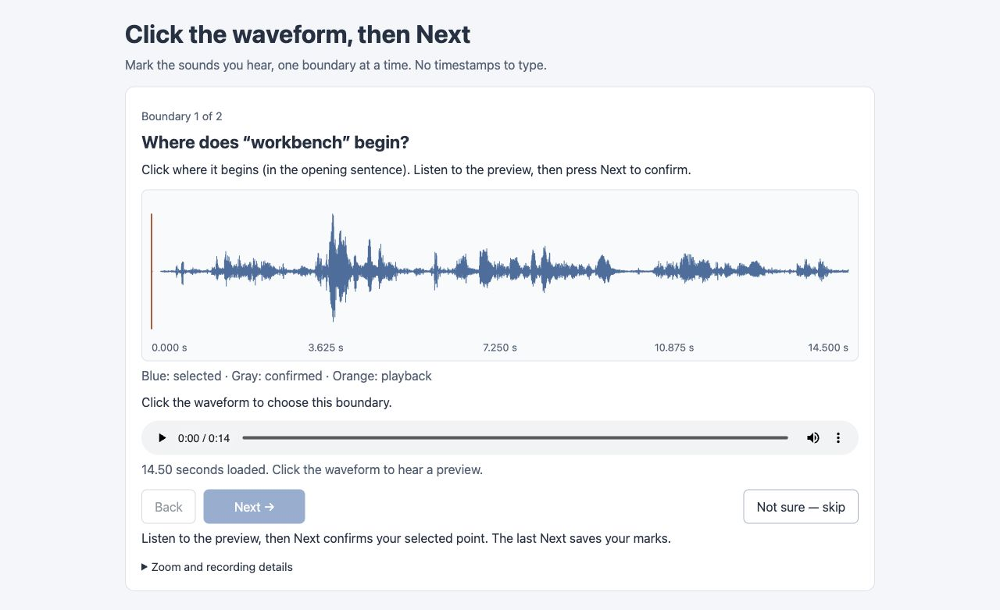

# Original opening context for workbench marking

Status: original context and interactive page are verified. Actual independent
human marks and the word-boundary diagnosis remain pending.

The [prepared local page](http://127.0.0.1:65242/) receives actual marks in
`/tmp/screenrec-workbench-marking-20260930`. Its process identity at preparation
lives in root verification; later agents must check current state before treating
it as live. The page keeps its complete original in memory after loading, while
saving or reloading still requires the server. Reproduce with the existing
marking owner, this packet and a separate output directory; no permanent service
is added.

The existing speech candidates disagree about where “workbench” finishes in the
opening sentence. The [historical context evidence](../12-boundary-context/README.md)
cannot establish whether the later sound belongs to the word. This packet lets
the user mark its audible start and end in original narration using waveform
clicks and Next. The proposed text supplies context only; no estimated boundary
or prior mark supplies the answer.

[Original audio](original.wav) retains the opening context and following sentence.
The [manifest](manifest.json), actual [native request](request.json) and
[response](response.json) bind source, worker, range and delivered frames.
[Root verification](root-verification.json) compares every original PCM byte with
the actual sample-table-selected source packets and an independent FFmpeg decode,
and verifies the declared original clock. The [packet positions](source-packets.json)
retain that bounded source-byte selection. The container's `mdat` includes bytes
outside those declared packets, so treating its entire payload as contiguous
audio is not a valid reference. This is a
preservation proof, not an independent audible-word judgment.

[Annotations](annotations.json) own this page's sole word target and proposed
ASR text. Saved human records belong in a separate output directory, never in
this packet. Historical labels, accepted two-filler audio and the first marking
page remain intact. Actual confirmed marks must pass identity and clock checks
before the disputed word or corpus evidence can be reconciled.

The [marking owner](../../../../packages/test-harness/editing/speech-labeling.mjs)
accepts this explicit packet while preserving the original default target list.
The existing annotation owner exports only the word targets actually presented.
Seven focused tests pass on root. Independent review confirms complete source PCM
and unchanged default exports across full, partial and unconfirmed records.

[Browser evidence](verification.tar.xz) retains isolated muted tests, all initial
and final captures/crops, the wrong-export-owner negative control and fresh
reviews. All contained marks are synthetic, excluded from ground truth.
[Inventory](verification-inventory.json) binds every archived member. The final
page loads 14.50 seconds and advances through two prompts before saving. The
color legend explains playback versus selection; a successful save clears the
temporary selected marker. Default notes, preview policy and clock owner remain
unchanged. The user page starts unmarked and paused; no automatic audible playback
occurred.

Fresh visual review found no blocking defect. Minor repeated completion wording
and the prominent raw save path remain disclosed in its archived review; no
all-viewport or listening claim follows. Shape/diff/docs review retains the
existing owners with no new dependency, production API or model. Independent
Codex CLI review remains unavailable because its configured model is unsupported;
no model/config change or retry was performed.
