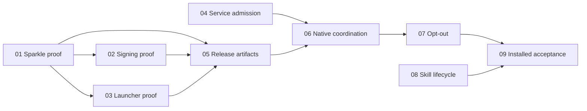

# Automatic app and CLI updates

An installed release downloads updates automatically and replaces the app only
when existing work is finished. The bundle contains the actual CLI, Node, service
and workers, so they update together. Skill changes remain explicit through
`npx skills`. The [decision map](discovery.md) owns user requirements, attribution
and rationale; this ladder owns implementation order and proof status.

## Next Agent Prompt

**Status:** implementation in progress; native engine acceptance is **RED**.
**Updated:** 2026-10-04.

Read [01's proof status](slices/01-sparkle-replication.md#proof-status) first.
The committed lab authenticates and replaces scratch bundles, but upstream Sparkle
also replaces a staged bundle on busy ordinary quit without install permission.
No accepted updater winner exists. Cancellation at ready is asynchronous and is
not a helper acknowledgement. Do not port this unsafe behavior to production.

The user approved a small pinned Sparkle source patch and full Xcode installation.
The corrected installer must require explicit install permission and own the CLI
replacement lock through host exit, bundle swap and relaunch acknowledgement.
Xcode setup and the minimal patch are underway. The upstream callback currently
announces installation before the installer lock could be acquired, and relaunch
is asynchronous; reproduce these handshakes rather than assuming callback order
provides exclusion. No production updater is installed until the corrected proof
passes.

Completed independent passes are integrated. [04 service admission](slices/04-service-admission.md)
grants atomic private permits and accounts existing-owner lifetimes; repeated
release succeeds without touching a successor, while stale commitment fails.
[08 skill lifecycle](slices/08-skill-lifecycle.md) has documented real-installer
and focused model proof. Its controlled health inputs now match the service's
`status`, `version` and `update` projection; previous model receipts retain their
original input scope. Live published-source onboarding and the final two-trial
matrix remain open. [03 launcher proof](slices/03-launcher-replacement.md) freezes
the shared-lock result; actual installer ownership remains open.

Next, resolve and reproduce the corrected engine before signing, packaging and
native integration. The remaining proof gates still apply. Do not repeat unchanged
native or portable probes to imply progress past this engine gate.

Use scratch app locations, defaults, keys and libraries. Never use the user's
installed app, permission grants or recording library as fixtures. Release identity
custody and recipient TCC/Gatekeeper behavior are unverified. Choose and commit
release version before final artifacts; review/push/tag only verified source.

- [ ] [01: prove Sparkle authentication, admission and install paths](slices/01-sparkle-replication.md)
- [ ] [02: prove release signing and permission boundaries](slices/02-signing-identity.md)
- [ ] [03: prove launcher and old-client replacement safety](slices/03-launcher-replacement.md)
- [x] [04: make service update admission atomic](slices/04-service-admission.md)
- [ ] [05: package authenticated update and bootstrap artifacts](slices/05-release-artifacts.md)
- [ ] [06: port the proven engine to native lifetime coordination](slices/06-native-coordination.md)
- [ ] [07: expose a persistent opt-out in existing settings](slices/07-update-preference.md)
- [ ] [08: teach and evaluate explicit skill lifecycle](slices/08-skill-lifecycle.md)
- [ ] [09: prove the assembled installed upgrade and release](slices/09-installed-acceptance.md)

## Roadmap and review surfaces

The first useful checkpoint is a disposable A→B app update with an actual Sparkle
trace. Slices 03, 04 and 08 can be researched independently; implementation of
production replacement waits for the relevant proofs. Each slice has one contract
and a bounded probe/report. Release closeout is part of final acceptance, not a
separate rollout system. No HTML roadmap or new workbench is needed for this CLI
and native-settings feature.

## One owner per concept

| Concept | Owner and invariant |
| --- | --- |
| Scheduling, download, authentication, replacement and preferences | Sparkle; no second scheduler, defaults store, updater service or rollback daemon. |
| Installation opportunity | Native update coordinator joins existing native intent, service permit and launch/swap exclusion. It does not duplicate domain state. |
| Accepted work and resources | Service composition fences admissions; existing owners expose their own blockers, including transport reply/delivery lifetime. |
| Agent-visible projection and internal control data | Shared protocol owns schemas; native callbacks project state to `service.health`. No public updater command family or protocol-version negotiation. |
| Catalog format | Export the current authority from core; candidate metadata derives from it. Same-format updates only, no migrations. |
| Versions, signing and artifacts | App manifest owns version; existing build/release scripts preserve final signing and derive bundle/feed/receipt facts. |
| Safe CLI entry | Stable installed launcher contract established by slice 03, then reused by each app release. Actual CLI code remains in the replaced bundle. |
| Skill discovery and linking | `npx skills`; no custom skill manager. Consumer instructions own fetching/comparison and explicit update semantics. |

Waiting for idle leaves ordinary operations and resource renewals usable. A final
fence is a brief atomic attempt: if a blocker remains, reopen admission and wait
for existing-owner progress. Never freeze a workflow for minutes or maintain a
large updater allowlist to manufacture drain. Do not poll in a new retry loop;
reuse owner notifications and Sparkle's update cycle.

Check the committed permit before updater-initiated termination side effects.
Never close preview, finalize active capture or escalate signals to obtain idle.
Ordinary user/system quit retains its existing semantics. Prove how staged
installation is disarmed when opt-out or unsafe shutdown prevents replacement; never permanently prevent
ordinary quit for the updater.

There is no general backward-compatibility or data-migration plan. The identified
exception is a one-time manual bootstrap of old released apps and the coordinated
launcher. Personal source builds retain their separate identity/manual path.
Old live CLI/MCP processes are measured installation lifetimes, not permission to
add version negotiation or kill clients. If they block, report the blocker.

## Research refinements and evidence

Pin **Sparkle 2.10.0** and **skills 1.7.0** for the initial reproduction. Immutable
source/artifact identities and the limits of earlier observations live in
[research.json](assets/research.json). The prior [skill-link observation](assets/skills-links-proof.json)
proves only its reported local installer behavior; slice 08 reproduces it through
current production instructions. Neither a scratch summary nor official docs
constitutes updater acceptance.

The [pinned Sparkle delegate](https://github.com/sparkle-project/Sparkle/blob/eef1a539a373c1f1a320624b1130fc5de7b2e100/Sparkle/SPUUpdaterDelegate.h)
can retain an immediate-install block, but still attempts installation when the
app terminates. Therefore the replica must cover staged opt-out and ordinary quit,
not only the relaunch callback. Its
[feed driver](https://github.com/sparkle-project/Sparkle/blob/eef1a539a373c1f1a320624b1130fc5de7b2e100/Sparkle/SUAppcastDriver.m)
verifies signed feeds before selection; custom item properties are exposed by the
[item API](https://github.com/sparkle-project/Sparkle/blob/eef1a539a373c1f1a320624b1130fc5de7b2e100/Sparkle/SUAppcastItem.h).

Planning refinement, answered by the agent on the user's behalf to preserve the
agreed authenticated compatibility contract: require signed feeds as well as
archives. Set `SURequireSignedFeed=YES`, `SUVerifyUpdateBeforeExtraction=YES` and
`SUSignedFeedFailureExpirationInterval=0`; the latter prevents the default
signed-feed failure fallback. Owner-derived catalog format appears in both bundle
and signed feed, with agreement verified by packaging. Slice 01 must prove the
extension roundtrip and veto callback before these become production assumptions.

Draft synthesis: the fewest-slices and risk-first drafts agreed on separating
engine, signing and launcher proofs. The Claude seam draft contributed checksum
scope, release-only configuration, defaults isolation and quiet relaunch checks.
Its immediate-block-only installation assumption was contradicted by pinned source;
its long fence was rejected because waiting workflows must remain usable. The
larger draft ladders were merged at existing owners, with no separate publication
ceremony. Discovery findings do not waive a proof gate.

| Preservation claim | Evidence and owner | Production parity/acceptance |
| --- | --- | --- |
| Supported authentication, veto, staging and quit behavior | [Frozen rejected upstream reproduction](assets/sparkle-reproduction.json); corrected engine remains OPEN | 06 replays accepted inputs through production; 09 confirms assembled behavior. |
| Stable release identity and observed permission behavior | OPEN: 02 public identity/OS observations | 05 preserves recipe; 09 reruns only if packaging invalidates it. |
| Complete bundle loads and safe old-client lifetime | [Frozen reader-lock proof](assets/launcher-lifetime-proof.json); actual installer ownership remains OPEN | 06 drives production entry with those barriers; 09 verifies the installed launcher. |
| Canonical skill links/references and explicit overwrite | [Real documented-command parity](assets/skills-production-parity.json) and [focused agent matrix](assets/skills-model-trials.json) | Published-source onboarding and final repeated matrix remain OPEN in 08/09. |

Each accepted spike freezes runnable source/config/dependencies, controlled inputs,
platform and complete positive/negative traces by commit and digest. Production
parity uses those exact inputs before expensive installed confirmation. Reports
bind source revision, input hashes, runner command, outcome and owning slice;
retain secrets nowhere. Store small feature evidence here; generated app bundles
and large media stay outside Git with immutable receipts/reproduction commands.

## Verification and scope

Every behavior slice follows write-tests red/green. Use barrier fixtures and the
narrowest owning suite; do not repeatedly build/record/render to prove service
accounting. Run the required full repository checks once at completed implementation,
as [AGENTS.md](../../AGENTS.md) directs. Docker evaluates skill/CLI agent behavior;
macOS installed proof evaluates Sparkle, permissions and bundle replacement.

Any visual slice archives its baseline/candidate under this feature, uses
[compare-screenshots](../../.agents/skills/compare-screenshots/SKILL.md), then runs
unprimed [screenshot-critique](../../.agents/skills/screenshot-critique/SKILL.md) as
the last visual acceptance check. Show shots through
[preview-shots](../../.agents/skills/preview-shots/SKILL.md); allow about five minutes
for non-blocking reversible feedback while continuing independent work. If silent,
record the evidence-based choice, close the shots and proceed. This is no release
approval gate; missing required OS interaction or credentials is not implied consent.

No automatic skill edits, model downloads, permission grants, media edits, catalog
reconstruction, tester-feedback process or new update server. Authentication,
launcher safety, no interruption and populated-library usability remain mandatory.
Failed proof means reslice, not waive. The slices name implementer freedoms; a new
policy or external contract is a spec change, not an unlisted convenience choice.
