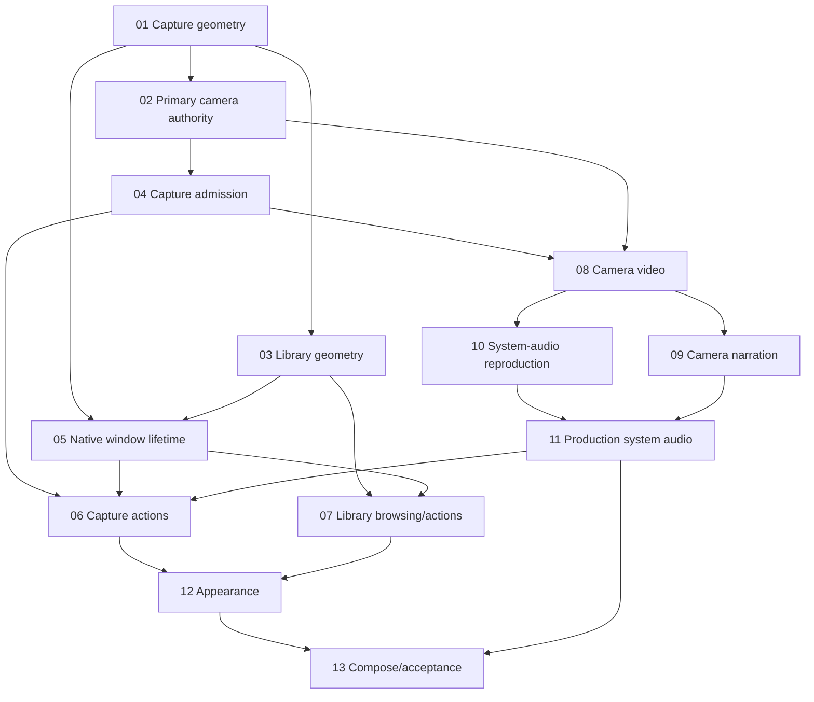

# Capture popover and independent Library

Replace the command-list menu with the selected Design A capture panel. Move saved
recordings, projects, exports and storage into one persistent Library window.
Include explicit camera selection and Camera Only without changing source-media
ownership or making editorial decisions.

## Next Agent Prompt

**Status: implementing. Updated October 5, 2026.**

The user authorized the full build through `/goal /implement-spec`. Capture
geometry 01 and primary publication proof 02 are integrated on `feat/capture-menu`;
shared admission/permissions 04 is completing its reviewed checkpoint. Current
pickup: integrate Library geometry 03, then replace the old menu in 05. Preserve
existing recordings and originals; hard cutover/no shims/no migrations is confirmed.

Parallel lanes:

- `/tmp/screenrec-capture-ui`: Library geometry 03, shared semantic presentation.
- `/tmp/screenrec-capture-authority`: primary camera input 08/09 after 04 integration.
- `/tmp/screenrec-library-paging`: independent 07 backend paging/fencing; view
  binding waits for 03/05. This refinement has no dependency on the new window.

Evidence: [01 geometry](evidence/01-capture/report.md),
[02 publication](assets/evidence/02-primary-camera-authority/README.md),
[04 admission](evidence/04-admission/report.md) and
[04 permissions](evidence/04-permissions/README.md). Geometry fixtures prove the
production components, not a production cutover or capture. Obtain an actual old
native menu baseline before removing it in 05; that comparison is still OPEN.

Read-only host inventory found no camera or microphone input. Physical camera,
narration and system-audio gates remain OPEN; no prompt/device session was opened.
Fixture evidence cannot close them. Continue independent implementation, preserving
the frozen system-audio reproduction requirement before production parity in 11.

Use tests first, narrow checks and separate worktree build outputs. Follow
[verification.md](verification.md) for visual comparisons, fresh critique last,
and non-blocking preview review. Run the full required suite once implementation
is finished. Preserve unrelated dirty workspace files. No app install or physical
capture has occurred. Per-pass choices live in [choices.md](choices.md).

- [x] [01 — Capture geometry fixture](slices/01-capture-geometry.md)
- [x] [02 — Primary camera authority proof](slices/02-primary-camera-authority.md)
- [ ] [03 — Library geometry fixture](slices/03-library-geometry.md)
- [x] [04 — Canonical selection, discovery and permission admission](slices/04-capture-admission.md)
- [ ] [05 — Native popover/window lifetime](slices/05-native-window-lifetime.md)
- [ ] [06 — Capture actions and inline state](slices/06-capture-actions.md)
- [ ] [07 — Library paging and existing actions](slices/07-library-browsing.md)
- [ ] [08 — Camera-primary video/device clock](slices/08-camera-primary-video.md)
- [ ] [09 — Camera-primary narration](slices/09-camera-narration.md)
- [ ] [10 — Bounded system-audio reproduction](slices/10-system-audio-reproduction.md)
- [ ] [11 — Production system-audio parity](slices/11-camera-system-audio.md)
- [ ] [12 — System appearance/contrast](slices/12-system-appearance.md)
- [ ] [13 — Composed native acceptance and closeout](slices/13-integrated-acceptance.md)

Before ending each pass, update this prompt with the exact next pickup point,
slice/evidence status, blockers and remaining checklist. A fresh agent must not
need scrollback to distinguish implemented, verified and still-open work.

## Review surface

[Selected clickable concept](visualizations/design-a-camera.html) ·
[sharp selected layout](assets/references/camera-idle-sharp.png) ·
[landmarks and provenance](assets/README.md).

The first useful checkpoint is a native production-view fixture with source tiles,
device rows and reachable Start/footer at approved density. Its facts are synthetic;
it proves presentation, not capture. Library geometry follows independently. The
earliest camera proof uses prerecorded pictures, existing journals and admission.
Live acquisition starts only after that authority gate.

Every slice declares one API question or visual variable, its artifact, verdict,
preservation checks and implementer freedoms. The graph is a dependency map,
not an instruction to run expensive work concurrently. Follow repo resource rules.

After the early fixtures/proof, finish native lifetime and Library while answering
camera acquisition gates. Bind the final capture flow only after all requested
inputs work; do not introduce temporary capability flags or apparent readiness.
The intermediate fixture remains inspectable throughout.

## Contracts and scope

[decisions.md](decisions.md) owns the attributed choices and exact capture shape.
[research.md](research.md) owns measured findings, primary sources and draft
synthesis. [verification.md](verification.md) owns the preservation/parity matrix.

The approved popover has Display, Window, Area and Camera Only in two columns;
camera/microphone/system-audio/countdown rows; start/live transport; inline recovery;
Settings, Library navigation and Quit. It contains no saved-media lists. Library
is a separate independent window, not a modal sheet attached to the popover.

Camera Only requests one selected camera as primary video. Screen plus camera
retains the existing companion source and independent origins. Neither capture
mode creates a composition, PIP layout, crop, mix or editing project. No source
media is modified. Current microphone/system-audio defaults remain authoritative.

Library uses existing bounded recording/project pages. Its filter is explicitly
page-local; Exports contains tracked deliveries and unfinished recovery. Global
search, full historical export browsing, thumbnail preparation pipelines, live
camera preview, another audio backend, release/install work and data migration
are outside this feature.

## One owner per concept

- Capture selection/action applicability: existing ControlsState and
  RecordingControls dispatch; views never call the service independently.
  Preserve ControlsAction outside the deleted menu renderer. Shared recording
  titles/status and export action applicability/formatting belong to controls
  presentation owners consumed directly by popover, Library and probes.
- Time: CaptureClock/CaptureWriter; external timestamps use CaptureClockIngress.
  No UI-derived recording clock and no rebasing existing companion camera media.
- Physical acquisition/drain: CaptureInputPreparation/CaptureInputSession and
  NativeCapture termination. Shared audio input stays shared across primary kinds.
- Allocation/publication/admission: existing service/core/native authority owners.
  Device kind does not determine primary versus companion role.
- Library generations/pages/deletion: LibraryController. Export recovery and
  project preview retain their current owners, identities and pinned intent.
- Native presentation: one capture container and one Library window. Share window
  key equivalents with Settings; do not copy a second main-menu installer.
- Test oracle: authored fixture expectations and frozen references. Harnesses draw
  production components and exercise current owners; no test-only recorder/menu.

The end state must read as designed today. When the popover replaces the NSMenu,
remove the old renderer and migrate its semantic probe/test consumers. Do not keep
an invisible menu, aliases or a second presentation model for compatibility. Any
temporary view wiring ends in slice 05; the fixture harness remains an explicit
production-view consumer, not transitional product code.

## Unknowns and reslicing

Primary-camera publication under existing layouts is proved in 02. Native
focus/keyboard behavior is proved in 05 and confirmed without activation-suppressed
probe mode in 13. Camera/narration physical clocks are proved in 08/09. Whole-system
sound without screen-video output is reproduced/frozen in 10 and compared through
production in 11. A failed gate updates its owning slice before dependent work.

No failed gate permits a schema migration, hidden screen media, different system
sound scope or removal of the selected capability. A concrete new scope tradeoff
is shown to the user; routine reversible implementation choices remain delegated
only where named in the slice. Visual reviews are opportunities to course-correct,
not waits for approval.
