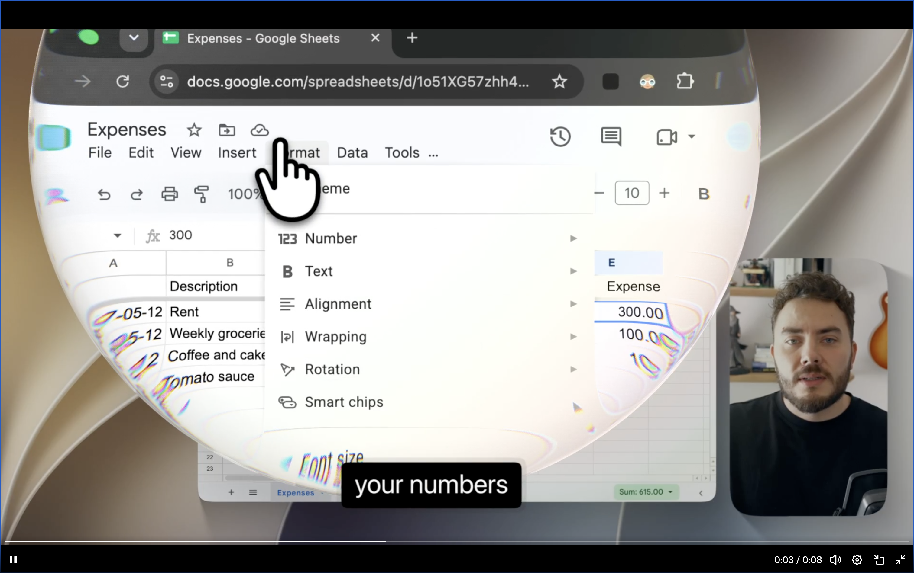
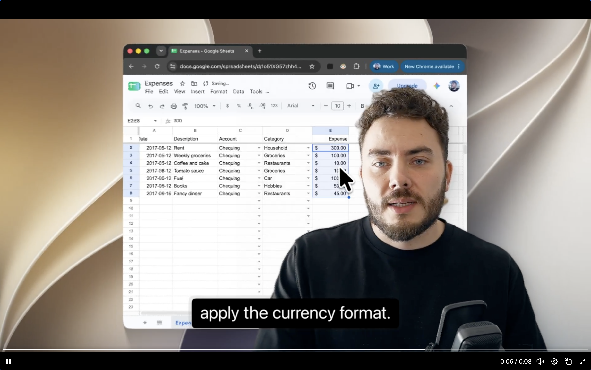
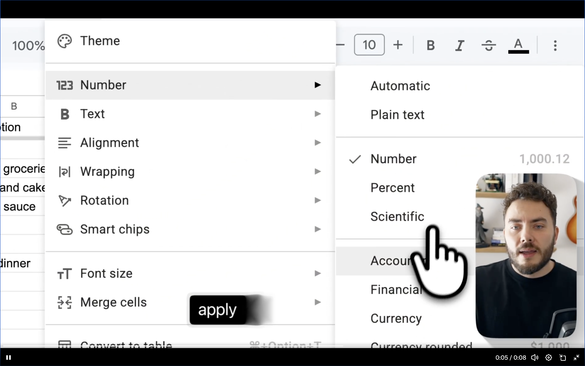

# Presenter and screen effects

Status: **early placeholder**, 2026-10-01. This records desired capabilities and
visual references, not an implementation-ready plan or a claim of current support.
It does not replace or reorder the [active toolkit plan](../agent-editing/README.md).

## Next planning pickup

When this feature is explicitly picked up, inventory the current public capture,
composition and execution capabilities against the references below. Separate
already-supported operations from missing primitives, then sharpen the tentative
work areas into independently verifiable slices. Resolve the open questions before
selecting implementations or committing public schemas. Update this placeholder
with the resulting plan; do not start device capture or request another recording
merely to elaborate it.

## Goal and boundary

Let an external agent produce videos combining independently recorded screen,
camera and audio sources, with explicit layouts and effects after recording.
During recording, the user can see a live camera preview without that preview
being embedded in the recorded screen pixels.

The toolkit makes **zero editorial decisions**. The caller chooses source devices,
when effects occur, framing, camera prominence, pointer appearance, captions and
all treatment parameters. Evidence about clicks, speech or subjects may help the
caller make those choices; it never automatically applies an effect or creates
an authored composition. Previewing the camera does not authorize recording it.

Keep original sources intact. Capture publishes separate media and source/time
mappings; the caller authors the output through existing project/edit operations.
The live preview's position and size are monitoring state, not export layout.

## Reference assets

All three supplied screenshots are copied without modification. Their original
filenames, byte sizes and SHA256 identities live in [the asset manifest](assets/manifest.json).
The [linked example](https://x.com/pie6k/status/2105747150088937965?s=20) inspired
this request; its video was not accessible during drafting. The screenshots below
are the available visual authority. Player controls and black player borders are
reference framing, not requested output elements. Text inside the screenshots is
sample content, not instructions or required caption wording.

### Framed screen with camera inset and screen distortion

The screen appears as a curved or lens-distorted surface over a background, with
colored edge fringing. The presenter remains in a separate rounded rectangle.
An enlarged pointer and a caption remain readable. This suggests independently
controllable screen, presenter, pointer and text layers; the exact distortion
mechanism and processing order are unconfirmed.

### Enlarged presenter with background removed

The presenter occupies more of the composition and overlaps the screen. Their
camera background is absent around the visible silhouette. Enable an explicitly
requested matte/cutout or supplied alpha source and independent placement; this
reference does not establish the segmentation algorithm or edge quality in motion.

### Screen detail with rounded camera inset

The screen fills most of the output while the presenter occupies a smaller inset.
The pointer is strongly enlarged. The three states imply a desire to move between
layouts, but do not specify transition duration, easing or an exact motion path.

## Candidate work areas

These are provisional seams, not approved API names or a scheduled build ladder.
Reuse [existing ownership](../agent-editing/architecture.md#one-owner-per-concept)
and capability discovery; add only missing primitives.

| Area | Desired capability | First bounded proof |
| --- | --- | --- |
| Live monitoring | Preview the explicitly selected camera in a movable window, reusing the capture session where practical. Exclude recorder-owned preview windows from screen capture. | Demonstrate that preview visibility/position does not alter screen or camera source pixels; closing the preview does not end a requested recording. |
| Independent sources | Preserve screen, camera and audio separately, with honest offsets, gaps and timing provenance. | Reuse the [camera capture contract](../agent-editing/slices/21-webcam.md) and retained synchronization evidence; do not convert controlled proof into physical acceptance. |
| Layout and motion | Independently crop, scale, place and animate screen and presenter layers; support rounded insets, explicit backgrounds and compositing order. | A caller-authored fixture moves between inset and larger-presenter layouts using existing [geometry](../agent-editing/slices/15-layer-geometry.md) and [curves](../agent-editing/slices/16-keyframes.md), preserving source timing. |
| Presenter matte | Explicitly remove a camera background or consume an independently supplied matte/alpha source. | A fixed clip demonstrates hair, face, clothing and moving-edge behavior, with source preservation and bypass. Model/algorithm choice remains open. |
| Screen effects | Apply caller-selected screen warping, perspective or lens distortion and colored-edge treatment, independently of other layers. | Reproduce one declared screen-shape variable first, then edge treatment separately; establish coordinate mapping and effect order before integration. |
| Pointer and captions | Offer separately authored pointer styling/motion and timed text, readable across layouts. | Reuse captured pointer evidence and [text timing](../agent-editing/slices/17-text-captions.md). Define whether the source cursor is baked in and prevent unintended duplication; verify mapping through crop, warp and zoom. |

Composition remains the single owner of authored timing and parameter curves.
Capture owns acquisition and live monitoring; native execution consumes compiled
plans. Inspection, range preview and export must evaluate the same composition,
including absolute animation/caption phase. No separate effect timeline, implicit
presenter preset or second renderer interpretation is proposed.

## Open questions for the full plan

- Which reference behaviors already execute through the current public API,
  rather than merely being accepted by authoring schemas?
- What temporal behavior is desired between the three states? The stills cannot
  establish easing, duration, motion blur or synchronization with speech/clicks.
- Does background removal need a prepared local model, a supplied matte, or both?
  Choose from measured moving-edge quality, latency and resource costs.
- What exact screen distortion is needed, and should pointer overlays follow that
  distortion or remain in output space? Declare source-to-output mapping and order.
- What preview controls and behavior are needed before capture, during pause and
  after device loss? Preserve explicit camera permission and device selection.
- What resolution, frame rate and preview/export performance targets should the
  implementation satisfy? No new budgets or model selection are fixed here.

## Verification expectations

Start from existing recordings, annotations and accepted checks. Use explicit
fixture operations; no personal keep/remove judgment or automatic styling is a
development prerequisite. A new human test must identify one missing technical
fact and explain why retained evidence cannot establish it.

For later visual implementation slices, declare one judged variable and its
crop/mask. Use [compare-screenshots](../../.agents/skills/compare-screenshots/SKILL.md)
against the relevant reference region, then an unprimed
[screenshot-critique](../../.agents/skills/screenshot-critique/SKILL.md) as the last
visual acceptance check. Compare moving sequences when judging transitions or
matting; static screenshot similarity alone cannot establish those contracts.
Retain baseline/candidate artifacts and distinguish appearance, exact source
preservation, synchronization and performance claims. Existing release gates
remain unchanged.
