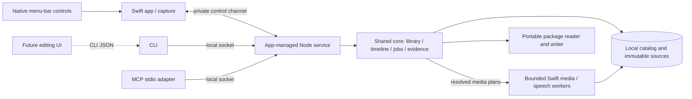

# Recording for AI — personal release spec

Status: spec complete; implementation partial. Last updated: 2026-09-17.
Package registry/export integration and the remaining native capture, speech and
installed-workflow gates are still open. The handoff and slice checklist below
separate verified internal behavior from full personal-release acceptance.

## Next Agent Prompt

You are implementing the personal Mac release. Read this spec, its
[contracts](contracts.md), [architecture](architecture.md), and
[verification](verification.md), then resume from the current pickup below.
Honor the product decisions in the [discovery map](MAP.md); this spec resolves its
technical OPEN entries through concrete contracts or named gated slices.

Use Bun workspaces and the factory/photoctl monorepo pattern. Keep native capture
and media execution in Swift, and shared library/edit/timeline behavior in one
TypeScript core. CLI and MCP expose the same full operation registry. The future
editing UI calls the CLI.

Work through dependency-ready slices, committing focused green checkpoints when
a repository is initialized for implementation. Do not invent a remote, push target
or distribution step. Collect real native, speech and client evidence: a protocol
mock is not an image-visibility result, and an untested ASR engine is not a solution
to removing fillers. If a feasibility gate fails, reslice its bounded alternative;
do not quietly reduce scope. Continue independent work while an actual user
recording or permission is pending, but do not call that gate passed.

Update this section and the owning slice before ending each implementation pass:
completed work, exact next pickup, evidence paths, failures and delegated decisions.
Current pickup: implement registry storage reservations, admitted archive inputs
and retryable startup/full-close cleanup in
[14c](slices/14-exports-and-package-reader.md#14c--archive-boundary-and-package-lifetime).
The shared queue now has [transient contexts](slices/14c3a-transient-context-jobs.md);
public handles must use these capabilities and the retained native descriptor owner.
In parallel, implement durable video export intent through real cancellation,
restart and recording deletion in [14d](slices/14d-export-publication.md). Its native
no-clobber publication owner is verified; dependency waiting and public exports remain.

Priority order: package/export execution, remaining native controls and physical
capture/gesture verification, speech fidelity, then installed-workflow closeout.
Keep one queue, immutable sources, explicit dependency failure and the complete
CLI/MCP surface. No more Claude use.

Recent integration evidence:

- [Retained package inspection](slices/14c2-retained-package-inspection.md) preserves
  admitted files and native workers through relocation, close and parent death.
  [Transient contexts](slices/14c3a-transient-context-jobs.md) share queue capacity
  and release terminal metadata for continued requests. Registry/storage recovery
  and public selectors remain. [Reusable outputs](slices/14c3b1-package-output-release.md)
  now return storage after reads drain; real ZIP/native repetition and merged public
  delivery/deletion checks pass.
- [External publication](assets/export-publication/native-owner.md) passes native
  no-clobber publication and process-crash reconciliation. Durable intent and actual
  recording-deletion integration remain next.
- [Public preview](assets/preview-publication/public.md) passes generated pointer,
  cut/pause, CLI/MCP parity, restart and deletion checks. The
  [native player](assets/preview-publication/player.md) passes real bundled-service
  edit/renew/delete integration. Live window inspection confirms complete fixture
  framing only; physical status-menu interaction, controls, full visual acceptance
  and speech audition remain open.
- [Capture endpoints](assets/capture-duration/README.md),
  [geometry placement](assets/source-timing/geometry-placement.md) and
  [pause placement](assets/source-timing/deferred-pauses.md) have merged native
  evidence. Keep these clock mappings in their native owner.
- [Generated index scale](assets/screenshot-index/performance.md) passes thirty
  minutes plus the long-input cache companion. Actual capture usefulness remains
  unverified. [Browser text](assets/text-fidelity/README.md) supports automatic
  bitrate; the controlled alternative did not improve readability.

Current evidence:

- Actual Codex [CLI](assets/agent-cli-journey/README.md) and
  [MCP image-block](assets/agent-mcp-journey/README.md) journeys read fresh image-only
  tokens and perform cut/inspect/stale rejection/undo on generated silent media.
  MCP includes one disclosed glyph misreading corrected by reinspection. Narration,
  captured-screen understanding, exports and installed acceptance remain open.
- [Audio inspection](assets/audio-inspection/review.md): real bundled worker,
  generated cuts/gaps, missing roles, CLI/MCP parity, cache regeneration and explicit
  retry. Numerical checks do not close audition or physical audio capture.
- [Clean frames](assets/frame-delivery/review.md) and [eight-image batches](assets/frame-delivery/batches.md):
  own-window and sparse generated sources, full resolution/crop, cuts, historical
  revisions, LRU/restart, actual CLI/MCP bytes and failure isolation. Public clean
  mode is available alongside [default trail images](assets/public-trails/review.md)
  and [generated boundary checks](assets/public-trails/boundaries.md).
  SDK receipt is not model-level recorded-image understanding.
- [Source timing](assets/source-timing/integration-review.md), [indexed trail evidence](assets/trail-evidence/review.md)
  and [scene compatibility](assets/scene-analysis/core-review.md): shared normalized
  cursor/geometry/pause/audio evidence and bounded comparisons. Real UI scene
  thresholds and captured gesture acceptance remain open. [Canonical scans](assets/scene-analysis/canonical-scan.md)
  now retain chunked coverage and actual-time boundaries across restarts.
- [Native controls](assets/recording-controls/integration.md): closed-menu state and
  clock follow actual own-window service-driven capture. Native UI interaction,
  display/region placement and physical audio remain unverified. Localhost browser
  automation works. A [native gesture probe](assets/real-gesture-probe/review.md)
  reached the fixture UI but recorded no inside cursor observations; physical
  gesture acquisition remains unverified.
- [Discovery](slices/15a-client-discovery.md) passes a built-app launch, not an
  installed-copy workflow. [Durable jobs](assets/durable-jobs/review.md) preserve
  attempt identity and retain capacity until workers exit.
- [Speech](slices/04-local-speech-gate.md) remains a feasibility gate. No engine
  meets the required fidelity; the research-only [alternative](assets/speech/verbatim-alternative.md)
  also exceeds the memory target and has a restrictive license. Do not claim
  filler editing from metadata fixtures or replace real narration with TTS.

The original [verification gates](verification.md) remain requirements. Fixtures
and unit checks do not close the full read → edit → inspect → export journey.

- [ ] [00 — Workspace and runnable native harness](slices/00-workspace.md)
- [x] [00b — Real-agent image access](slices/00b-client-image-probe.md)
- [ ] [01 — Native capture and separate audio](slices/01-native-capture.md)
- [ ] [02 — Recover interrupted source media](slices/02-interruption-recovery.md)
- [ ] [03 — Cursor positions in captured coordinates](slices/03-cursor-geometry.md)
- [ ] [04 — Select a verbatim local speech engine](slices/04-local-speech-gate.md)
- [x] [05 — Pure non-destructive timeline engine](slices/05-timeline-and-revisions.md)
- [ ] [06 — Single-writer library and app-managed service](slices/06-service-and-jobs.md)
  - [x] [06a — Durable revision transactions](slices/06a-revision-store.md) (independent after 05)
  - [x] [06b — Bounded local transport](slices/06b-local-transport.md) (independent after 00)
  - [x] [06c — App-owned service lifetime](slices/06c-app-service-lifetime.md) (independent after 00, 06b)
  - [x] [06d — Durable recording lifecycle](slices/06d-recording-lifecycle.md) (storage proof)
  - [x] [06e — Library operations through the service](slices/06e-library-operations.md) (independent after 06a–06c)
  - [x] [06f — Native capture service control](slices/06f-capture-service.md) (own-window control/recovery proof)
  - [x] [06g — Durable artifact jobs](slices/06g-durable-jobs.md) (core queue)
  - [x] [06h — Normalized cursor evidence index](slices/06h-evidence-index.md)
  - [x] [06i — Source processing integration](slices/06i-source-processing.md)
  - [x] [06j — Source timing evidence](slices/06j-source-timing.md)
- [ ] [07 — Usable menu-bar recording controls](slices/07-menu-bar-controls.md)
- [ ] [08 — Durable local transcription and projections](slices/08-transcript-processing.md)
- [ ] [09 — Arbitrary clean frames and media excerpts](slices/09-frame-inspection.md)
  - [x] [09a — Native kept-interval frame decoding](slices/09a-native-frame-decode.md) (independent after 00)
  - [x] [09b — Native retained-span audio excerpts](slices/09b-native-audio-excerpts.md) (generated-media execution; audition still open)
  - [x] [09c — Derived cache primitive](slices/09c-derived-cache.md) (public delivery remains)
  - [ ] [09d — Revision-bound public frame inspection](slices/09d-public-frames.md)
  - [x] [09e — Revision-bound audio inspection](slices/09e-public-audio.md) (generated public-media proof; parent audition gate remains)
- [ ] [10 — Readable cursor trails on requested frames](slices/10-cursor-trails.md)
  - [x] [10a — Native cursor and trail rendering](slices/10a-native-cursor-render.md) (independent after 09a)
  - [ ] [10b — Shared clean visual observations](slices/10b-visual-observations.md)
  - [ ] [10c — Requested-time trail planning](slices/10c-trail-timing.md)
  - [x] [10d — Indexed trail evidence](slices/10d-trail-evidence.md)
  - [ ] [10e — Default public trail frames](slices/10e-public-trails.md)
  - [x] [10f — Durable shared scene evidence](slices/10f-durable-scenes.md)
- [ ] [11 — Useful bounded screenshot index](slices/11-screenshot-selection.md)
  - [x] [11a — Incremental selection ledger](slices/11a-selection-ledger.md)
  - [x] [11b — Shared frame materialization](slices/11b-shared-frame-materialization.md)
  - [ ] [11c — Retained index and public delivery](slices/11c-retained-index.md)
- [ ] [12 — Complete CLI/MCP inspection and editing](slices/12-cli-mcp-operations.md)
  - [x] [12a — CLI/MCP adapter seam](slices/12a-cli-mcp-adapters.md) (current library/edit operations)
- [ ] [13 — Playable edited media and audio joins](slices/13-edited-media.md)
  - [x] [13a — Native render timing feasibility](slices/13a-native-render-timing.md) (independent of speech)
  - [x] [13b — Bounded retained audio stream](slices/13b-streaming-audio.md) (independent of speech and video job integration)
  - [x] [13c — AAC and video assembly](slices/13c-aac-movie-assembly.md) (generated encoded timing, lifetime and five-minute scale; parent audition remains)
  - [x] [13d1 — Native presentation evidence](slices/13d1-presentation-evidence.md) (bounded exact support)
  - [x] [13d2 — Shared presentation-point policy](slices/13d2-presentation-pointer-core.md) (point inspection only; native composition remains)
  - [x] [13d3 — Sequential pointer schedule](slices/13d3-pointer-schedule.md) (exact events/reset memory; native composition remains)
  - [x] [13d4 — Native pointer composition](slices/13d4-pointer-composition.md) (exact encoded transitions; physical gesture acquisition remains)
  - [ ] [13e — Preview publication and playback](slices/13e-preview-publication.md) (public delivery, staging recovery and native service/player lifetime verified; actual menu/visual acceptance remains)
- [ ] [14 — Two exports and relocated AI inspection](slices/14-exports-and-package-reader.md)
  - [x] [14a — Pinned package manifest and truthful readiness](slices/14a-package-manifest.md)
  - [x] [14b — Portable read-only inspection](slices/14b-portable-inspection.md) (internal directory/native parity; ZIP and public handles remain)
    - [x] [14b1 — Shared inspection read seam](slices/14b1-audio-read-seam.md) (consumer planning, not full package relocation)
    - [x] [14b2 — Portable normalized source queries](slices/14b2-source-evidence-pages.md) (source-only relocation)
    - [x] [14b3 — Retained evidence and native relocation](slices/14b3-retained-inspection.md) (shared readers and fresh-process frame/audio parity)
  - [x] [14c1 — Bounded archive extraction](slices/14c1-bounded-archive-extraction.md)
  - [x] [14c2 — Retained archive inspection](slices/14c2-retained-package-inspection.md) (native descriptor containment and parent-death lifetime; public handles remain)
  - [x] [14c3a — Transient package job contexts](slices/14c3a-transient-context-jobs.md) (shared scheduling and bounded metadata; registry/public handles remain)
  - [x] [14c3b1 — Reusable outputs and isolated delivery](slices/14c3b1-package-output-release.md) (native storage/read lifetime; registry recovery remains)
- [ ] [15 — Installed personal workflow and closeout](slices/15-personal-release.md)
  - [x] [15a — Client discovery](slices/15a-client-discovery.md) (built-app launch; installed-copy gate remains)
  - [x] [15b — Recording storage and manual deletion](slices/15b-storage-and-deletion.md)

## Outcome

Record a narrated website demonstration on localhost, then tell an external coding
agent to inspect the latest recording. It reads word-timed narration and a screenshot
index, requests images/audio at useful moments, and uses cursor trails to understand
what was pointed at. It can trim or cut specified ranges, undo, and inspect or export
the edited result.

“Cut out the ums” and “cut out the part where I said this is free” are external-agent
workflows over evidence and explicit edit operations. The app contains local speech
recognition but no assistant, semantic editing model, rewriting or summarization.
The original recording and non-destructive history remain intact.

## Settled scope

- macOS menu-bar app; display/window/region capture, microphone narration and optional
  separately captured system/browser audio. All system audio is the initial filter;
  source selection does not imply browser-tab sound isolation.
- Start, stop, cancel, pause/resume and restart through native controls/shortcuts
  and machine operations. Pauses omit media time but add explicit elapsed-pause markers.
- Local English transcription with words, fillers/repetitions and timestamps.
- Clean source media plus raw cursor history; default two-second fading trail on
  inspection images, reset at pause/cut/scene/geometry boundaries; optional clean frames.
- Visual-change/coverage/cursor-aware screenshot index; arbitrary frame, crop,
  transcript, timeline, cursor and audio inspection.
- Latest discovers the newest take immediately, even before artifacts are ready.
  Separate readiness/failure/retry states let the caller wait and request again.
- Full CLI/MCP trim, batch cut, history, undo and restore. Revision-bound writes
  reject stale edits. Current/historical reads and exports pin a revision.
- Exactly two exports: playable human video, and the complete processed AI package
  including original media, source data, edits and current evidence. Package reader
  supports new frame requests after relocation.
- Preserve partial recordings honestly after interruption. Keep data until manually
  deleted; expose storage usage. Optimize short pointers and 2–5 minute walkthroughs,
  with bounded paged access to longer recordings.
- Personal host first. No drawings, webcam, editing timeline GUI, live AI streaming,
  cloud transcription, remote MCP, hosted sharing, accounts, public updater,
  speculative platform support, or general video effects in this release.

## Architecture in one view

[Architecture](architecture.md) names every owner, process lifetime and package.
[Contracts](contracts.md) specifies units, schema fields, operations, partial words,
pause/cut events, limits, request replay, audio mix and export semantics.
[Research](research.md) records actual SDK/reference evidence and the three-draft synthesis.

## Slice ladder and review surfaces

| Slice | Depends on | Review surface |
| --- | --- | --- |
| [00 Workspace and native harness](slices/00-workspace.md) | None | Local .app launch and protocol round trip |
| [00b Real-agent image access](slices/00b-client-image-probe.md) | 00 | Actual agent MCP/CLI image read |
| [01 Native capture and separate audio](slices/01-native-capture.md) | 00 | Three capture sources + isolated audio playback |
| [02 Recover interrupted source media](slices/02-interruption-recovery.md) | 01 | Killed writer, decoded recovered prefix |
| [03 Cursor positions in captured coordinates](slices/03-cursor-geometry.md) | 01 | Asymmetric grid and cursor error |
| [04 Select a verbatim local speech engine](slices/04-local-speech-gate.md) | 00 | Real narration, filler ledger, audible cuts |
| [05 Pure non-destructive timeline engine](slices/05-timeline-and-revisions.md) | 00 | Expected source spans and revision examples |
| [06a Durable revision transactions](slices/06a-revision-store.md) | 05 | Real SQLite replay, undo and competing writers |
| [06b Bounded local transport](slices/06b-local-transport.md) | 00, 06a for edit fixture | Real socket calls and bounded failure |
| [06c App-owned service lifetime](slices/06c-app-service-lifetime.md) | 00, 06b | Packaged app/child health, shutdown and failure |
| [06 Single-writer library and app-managed service](slices/06-service-and-jobs.md) | 02, 05 | Real-process state/race/restart cases |
| [07 Usable menu-bar recording controls](slices/07-menu-bar-controls.md) | 03, 06, 15b for delete/storage | Native controls and recording state shots |
| [08 Durable local transcription and projections](slices/08-transcript-processing.md) | 04, 06 | Word-timed transcript and retry |
| [09 Arbitrary clean frames and media excerpts](slices/09-frame-inspection.md) | 03, 05, 06 | Timestamped clean frames/audio |
| [10 Readable cursor trails on requested frames](slices/10-cursor-trails.md) | 09 | Circle/wave and boundary trail shots |
| [11 Useful bounded screenshot index](slices/11-screenshot-selection.md) | 10 | Contact sheet with selection reasons |
| [12 Complete CLI/MCP inspection and editing](slices/12-cli-mcp-operations.md) | 00b, 07, 08, 11 | CLI/MCP parity and actual agent edit calls |
| [13a Native render timing](slices/13a-native-render-timing.md) | 05 and native media worker | Exact cut timing and independently decoded output |
| [13b Bounded retained audio](slices/13b-streaming-audio.md) | Existing audio excerpt owner | Same sample policy with bounded streaming memory |
| [13 Playable edited media and audio joins](slices/13-edited-media.md) | 09, 12 | Audition/inspect actual edited media |
| [14a Package manifest and readiness](slices/14a-package-manifest.md) | Existing revision/evidence owners | Pinned history and prerequisite truth table |
| [14b Portable read-only inspection](slices/14b-portable-inspection.md) | 14a and shared inspection | Relocated directory, new frame/trail/audio requests |
| [14 Two exports and relocated AI inspection](slices/14-exports-and-package-reader.md) | 08, 11, 13 | Two exports; moved package, new frame |
| [15b Recording storage and manual deletion](slices/15b-storage-and-deletion.md) | 06 and cache/evidence ownership | Busy delete, restart cleanup and CLI/MCP storage totals |
| [15 Installed personal workflow and closeout](slices/15-personal-release.md) | 00–14 | Installed localhost journey and closeout |

Slices 00b, 01, 04 and 05 can progress independently after bootstrap; pending
client login in 00b does not block the other probes. Recovery follows
capture; geometry is judged separately. Image transport is proved early using a
fixture; the full AI edit journey waits for actual edit operations and media output.
No slice may declare a downstream contract complete using an upstream failed probe.

## Risk decisions before mechanical work

1. **Speech fidelity:** compare Parakeet and Whisper through real local runtimes.
   One engine ships; if neither passes filler/timing requirements, slice 04 owns a
   bounded alternative, not a model-picker detour.
2. **Recoverable media:** try native fragmented files before custom segmented
   storage. Slice 02 chooses from observed interruption behavior.
3. **Cursor geometry:** native metadata owns coordinate transforms. Slice 03 must
   prove moved-window and region behavior; later overlays cannot mask a bad transform.
4. **Scene/index policy:** deterministic heuristics with measured fixture outcomes.
   Slice 11 can tune thresholds, but cannot suppress cursor-only emphasis.
5. **Actual consumer:** prior Claude CLI evidence remains recorded, but the user
   requested no further Claude use. Complete later consumer gates with an available
   non-Claude agent through the same public operations.
6. **Fresh formats:** plan version 1 without migration/backward-compatibility machinery.
   Existing user recording data from another app was not requested for import.
7. **Package semantics:** preserve originals and edit history, label source/edited
   coordinates, export a pinned revision, and reopen with the same inspector.

The named engine, recovery, geometry, app/service lifecycle and actual-client checks
are explicit feasibility gates that may require technical reslicing. They never
authorize silently changing product scope. Other user-visible defaults are specified
in contracts, not left as guesses.

## Review and quality gates

Use [verification](verification.md) throughout. Every visual slice explicitly runs
unprimed screenshot-critique last; comparisons against references/prior frames use
compare-screenshots first. Native controls, geometry, trail styling, and frame
selection have separate review surfaces. Human visual checkpoints are non-blocking
for reversible choices; missing capture permission or actual narration is not
inferred from silence.

Use narrow tests during iteration and the broad local gate once at final closeout.
Substantive implementation receives code-review and a codex second opinion under
their skills. The spec itself has undergone independent draft synthesis, recursive
fog splitting, ownership review and link/contract review; these do not replace
future implementation testing.

## Spec maintenance and handoff

The [map](MAP.md) preserves user decisions and discovery evidence; its old OPEN
checklist and kickoff prompt are superseded by this spec. Keep it as rationale, not
a competing task list. A new discovery updates the relevant contract/slice and this
handoff; record changed user-visible choices in an implementation choices ledger.
No file may carry instructions to implement an abandoned architecture.

Implementation-only discretion: internal algorithms/names and reversible styling
within a slice's explicit acceptance tests. Undeclared new capability, incompatible
format, second owner, or altered product scope is a spec gap to resolve, not
permission for an implementer to guess.

When all gates ship, use close-spec to turn the plan into durable rationale. Future
work stays in the existing placeholders:
[tester release](../tester-release/README.md),
[public release](../public-release/README.md),
[editing UI](../editing-ui/README.md).
