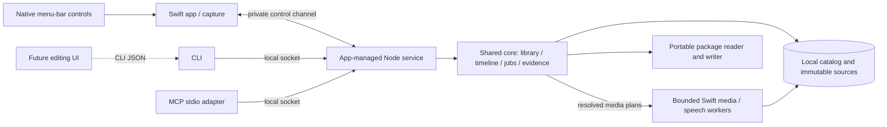

# Recording for AI — personal release spec

Status: spec complete; implementation partial. Last updated: 2026-09-26.
Everything the personal release needs is implemented and has run end to end on this person's own
narrated take: capture, transcription, evidence, editing, both exports and the installed journey.
What remains is acceptance that needs either a person at the Mac or a physical condition a check
cannot stage — named under the pickup below. The checklist separates verified internal behavior
from full personal-release acceptance.

## Next Agent Prompt

The active new-feature plan is [agent-operated video editing](../agent-editing/README.md),
with the current implementation pickup in its live Next Agent Prompt. Its [processing contract](../agent-editing/processing.md) includes the accepted
ordered-stack API. It defers the editing UI and replaces
the editing model through explicit preservation gates. This recording spec remains
the source of existing release evidence and unfinished acceptance; its status is
not upgraded by the new plan. Follow the new plan for editing work. The instructions
below apply when specifically continuing the original recording-release acceptance.

You are implementing the personal Mac release. Read this spec, its
[contracts](contracts.md), [architecture](architecture.md), and
[verification](verification.md), then resume from the current pickup below.
Honor the product decisions in the [discovery map](MAP.md); this spec resolves its
technical OPEN entries through concrete contracts or named gated slices.

Use Bun workspaces and the factory/photoctl monorepo pattern. Keep native capture
and media execution in Swift, and shared library/edit/timeline behavior in one
TypeScript core. CLI and MCP expose the same full operation registry. The future
editing UI calls the CLI.

Work through dependency-ready slices, committing focused green checkpoints. Do not
invent a remote, push target or distribution step. Collect real native, speech and
client evidence: a protocol mock is not an image-visibility result, and an untested
ASR engine is not a solution to removing fillers. If a feasibility gate fails,
reslice its bounded alternative; do not quietly reduce scope. Continue independent
work while an actual user recording or permission is pending, but do not call that
gate passed.

Each slice's Status line is the one home for what it verified, its evidence and
what remains open. Before ending a pass, update the owning Status lines and the
checklist box, then replace the pickup below.

Current pickup: nothing here is waiting on a machine. A slice-by-slice audit against the code on
2026-09-19 found two things the contract named that the code did not do, and both were then
built: a relocated package now renders and plays its own edit, and a key combination macOS itself
holds is refused rather than silently taken. What cannot be detected at all — another
application's private hot-key registration — is [recorded](choices.md) with its measurement.
Everything else unticked is acceptance that needs a person, a second display, sound playing, or an
agent that is not this one.

The installed app includes the requested Downloads default and the retained-index
remount fix. The person's current AI package exported successfully; evidence and the
remaining save-dialog check are recorded in [14d](slices/14d-export-publication.md).
Readable root documents and their verification are tracked in
[14d3](slices/14d3-processed-package.md); the package keeps the deeper evidence for
selective inspection after the initial transcript read.
Settings now shows the package-defined app version; [07a](slices/07a-settings-window.md)
records the build and visual verification. Remaining pickup is unchanged.

[08](slices/08-transcript-processing.md) is closed, including its real-narration gate: word
boundaries miss the 100 ms median target at 135 ms and are reported as missed, twelve of fifteen
outside the speech and three inside it ([evidence](assets/speech/boundaries/README.md)). Measuring
it fixed three real defects, the worst of which let a cut of one word silently delete the next.

Needing this person rather than a check:

- **System audio:** a take with something playing, which a check must not make this Mac do,
  and with it the A/V timing measurement that needs both tracks against a known event
  ([01](slices/01-native-capture.md)).
- **A region take:** proving where one landed means recording whatever is on the screen, and a
  fixture launch is refused every source but its own window precisely so an automated run cannot
  ([01](slices/01-native-capture.md), [03](slices/03-cursor-geometry.md)).
- **The menu bar and the pointer:** clicking the status menu, dragging the floating controls, and
  making the deliberate gestures the trail and index gates are about — computer-use reaches none
  of them on this Mac ([07](slices/07-menu-bar-controls.md),
  [10](slices/10-cursor-trails.md), [11](slices/11-screenshot-selection.md)).
- **Ears:** an audio excerpt, a recovered tail (`bun run lab:recovery --microphone` writes the
  clips), and a cut inside a rendered export
  ([09](slices/09-frame-inspection.md), [02](slices/02-interruption-recovery.md),
  [13](slices/13-edited-media.md)).
- **An agent that is not this one:** the real-narration journey through CLI and MCP
  ([12](slices/12-cli-mcp-operations.md)).

The installed copy was rebuilt and replaced on 2026-09-26. `bun run install:personal`
replaces it on subsequent changes and refuses while the app is running.

Priority order: the two recorded capability decisions, then whatever the person answers above.

The original [verification gates](verification.md) remain requirements. Fixtures
and unit checks do not close the full read → edit → inspect → export journey.

- [ ] [00 — Workspace and runnable native harness](slices/00-workspace.md)
- [x] [00b — Real-agent image access](slices/00b-client-image-probe.md)
- [ ] [01 — Native capture and separate audio](slices/01-native-capture.md)
- [ ] [02 — Recover interrupted source media](slices/02-interruption-recovery.md)
- [ ] [03 — Cursor positions in captured coordinates](slices/03-cursor-geometry.md)
- [x] [04 — Select a verbatim local speech engine](slices/04-local-speech-gate.md)
- [x] [05 — Pure non-destructive timeline engine](slices/05-timeline-and-revisions.md)
- [ ] [06 — Single-writer library and app-managed service](slices/06-service-and-jobs.md)
  - [x] [06a — Durable revision transactions](slices/06a-revision-store.md)
  - [x] [06b — Bounded local transport](slices/06b-local-transport.md)
  - [x] [06c — App-owned service lifetime](slices/06c-app-service-lifetime.md)
  - [x] [06d — Durable recording lifecycle](slices/06d-recording-lifecycle.md)
  - [x] [06e — Library operations through the service](slices/06e-library-operations.md)
  - [x] [06f — Native capture service control](slices/06f-capture-service.md)
  - [x] [06g — Durable artifact jobs](slices/06g-durable-jobs.md)
  - [x] [06h — Normalized cursor evidence index](slices/06h-evidence-index.md)
  - [x] [06i — Source processing integration](slices/06i-source-processing.md)
  - [x] [06j — Source timing evidence](slices/06j-source-timing.md)
- [ ] [07 — Usable menu-bar recording controls](slices/07-menu-bar-controls.md)
  - [x] [07a — Settings window, permissions and launch at login](slices/07a-settings-window.md)
  - [ ] [07b — Countdown and recording overlay](slices/07b-recording-overlays.md)
- [x] [08 — Durable local transcription and projections](slices/08-transcript-processing.md)
- [ ] [09 — Arbitrary clean frames and media excerpts](slices/09-frame-inspection.md)
  - [x] [09a — Native kept-interval frame decoding](slices/09a-native-frame-decode.md)
  - [x] [09b — Native retained-span audio excerpts](slices/09b-native-audio-excerpts.md)
  - [x] [09c — Derived cache primitive](slices/09c-derived-cache.md)
  - [ ] [09d — Revision-bound public frame inspection](slices/09d-public-frames.md)
  - [x] [09e — Revision-bound audio inspection](slices/09e-public-audio.md)
- [ ] [10 — Readable cursor trails on requested frames](slices/10-cursor-trails.md)
  - [x] [10a — Native cursor and trail rendering](slices/10a-native-cursor-render.md)
  - [ ] [10b — Shared clean visual observations](slices/10b-visual-observations.md)
  - [ ] [10c — Requested-time trail planning](slices/10c-trail-timing.md)
  - [x] [10d — Indexed trail evidence](slices/10d-trail-evidence.md)
  - [ ] [10e — Default public trail frames](slices/10e-public-trails.md)
  - [x] [10f — Durable shared scene evidence](slices/10f-durable-scenes.md)
- [ ] [11 — Useful bounded screenshot index](slices/11-screenshot-selection.md)
  - [x] [11a — Incremental selection ledger](slices/11a-selection-ledger.md)
  - [x] [11b — Shared frame materialization](slices/11b-shared-frame-materialization.md)
  - [ ] [11c — Retained index and public delivery](slices/11c-retained-index.md)
- [ ] [12 — Complete CLI/MCP inspection and editing](slices/12-cli-mcp-operations.md)
  - [x] [12a — CLI/MCP adapter seam](slices/12a-cli-mcp-adapters.md)
- [ ] [13 — Playable edited media and audio joins](slices/13-edited-media.md)
  - [x] [13a — Native render timing feasibility](slices/13a-native-render-timing.md)
  - [x] [13b — Bounded retained audio stream](slices/13b-streaming-audio.md)
  - [x] [13c — AAC and video assembly](slices/13c-aac-movie-assembly.md)
  - [x] [13d1 — Native presentation evidence](slices/13d1-presentation-evidence.md)
  - [x] [13d2 — Shared presentation-point policy](slices/13d2-presentation-pointer-core.md)
  - [x] [13d3 — Sequential pointer schedule](slices/13d3-pointer-schedule.md)
  - [x] [13d4 — Native pointer composition](slices/13d4-pointer-composition.md)
  - [ ] [13e — Preview publication and playback](slices/13e-preview-publication.md)
- [ ] [14 — Two exports and relocated AI inspection](slices/14-exports-and-package-reader.md)
  - [x] [14a — Pinned package manifest and truthful readiness](slices/14a-package-manifest.md)
  - [x] [14b — Portable read-only inspection](slices/14b-portable-inspection.md)
    - [x] [14b1 — Shared inspection read seam](slices/14b1-audio-read-seam.md)
    - [x] [14b2 — Portable normalized source queries](slices/14b2-source-evidence-pages.md)
    - [x] [14b3 — Retained evidence and native relocation](slices/14b3-retained-inspection.md)
  - [x] [14c1 — Bounded archive extraction](slices/14c1-bounded-archive-extraction.md)
  - [x] [14c2 — Retained archive inspection](slices/14c2-retained-package-inspection.md)
  - [x] [14c3a — Transient package job contexts](slices/14c3a-transient-context-jobs.md)
  - [x] [14c3b1 — Reusable outputs and isolated delivery](slices/14c3b1-package-output-release.md)
  - [x] [14c3b2 — Admitted inputs and workspace cleanup](slices/14c3b2-package-workspace-primitives.md)
  - [x] [14c3b3 — Internal package registry](slices/14c3b3-package-registry.md)
  - [x] [14c3c1 — Public package admission and retained index](slices/14c3c1-public-package-index.md)
  - [x] [14c3c2 — Arbitrary package frame and audio](slices/14c3c2-package-frame-audio.md)
    - [x] [14c3c2a — Public arbitrary package frames](slices/14c3c2a-package-frames.md)
    - [x] [14c3c2b — Public package audio](slices/14c3c2b-package-audio.md)
  - [x] [14c3c3 — Public package raw cursor](slices/14c3c3-package-cursor.md)
  - [x] [14c3c4 — Public timeline inspection](slices/14c3c4-timeline-inspection.md)
  - [ ] [14d — Pinned export intent and atomic publication](slices/14d-export-publication.md)
    - [x] [14d2a — Durable video intent](slices/14d2a-video-intent.md)
    - [x] [14d2b1 — Deferred job admission](slices/14d2b1-deferred-admission.md)
    - [x] [14d2b2 — Pinned waiting exports](slices/14d2b2-pinned-waiting-video.md)
    - [x] [14d2b3 — Per-export abandonment](slices/14d2b3-export-abandonment.md)
    - [x] [14d2b4 — Queued publication recovery](slices/14d2b4-queued-recovery.md)
    - [x] [14d3 — Complete processed-package export](slices/14d3-processed-package.md)
      - [x] [14d3a — Bounded ZIP producer](slices/14d3a-archive-writer.md)
      - [x] [14d3b — Complete no-narration assembly](slices/14d3b-package-assembly.md)
    - [x] [14d4 — Persisted export discovery](slices/14d4-export-discovery.md)
- [ ] [15 — Installed personal workflow and closeout](slices/15-personal-release.md)
  - [x] [15a — Client discovery](slices/15a-client-discovery.md)
  - [x] [15b — Recording storage and manual deletion](slices/15b-storage-and-deletion.md)

## Outcome

Record a narrated website demonstration on localhost, then tell an external coding
agent to inspect the latest recording. It reads word-timed narration and a screenshot
index, requests images/audio at useful moments, and uses cursor trails to understand
what was pointed at. It can trim or cut specified ranges, undo, and inspect or export
the edited result.

“Cut out the part where I said this is free” and “cut out the ums” are external-agent
workflows over evidence and explicit edit operations. Filler removal is best-effort:
the transcript reports a filler only when the engine emitted one. The app contains local speech
recognition but no assistant, semantic editing model, rewriting or summarization.
The original recording and non-destructive history remain intact.

## Settled scope

- macOS menu-bar app; display/window/region capture, microphone narration and optional
  separately captured system/browser audio. All system audio is the initial filter;
  source selection does not imply browser-tab sound isolation.
- Start, stop, cancel, pause/resume and restart through native controls/shortcuts
  and machine operations. Pauses omit media time but add explicit elapsed-pause markers.
- Local English transcription with word timestamps; fillers and repetitions appear
  when the engine emits them, without a capture guarantee.
- Clean source media plus raw cursor history; default two-second fading trail on
  inspection images, reset at pause/cut/scene/geometry boundaries; optional clean frames.
- Visual-change/coverage/cursor-aware screenshot index; arbitrary frame, crop,
  transcript, timeline, cursor and audio inspection.
- Latest discovers the newest take immediately, even before artifacts are ready.
  Separate readiness/failure/retry states let the caller wait and request again.
- Full CLI/MCP trim, batch cut, history, undo and restore. Revision-bound writes
  reject stale edits. Current/historical reads and exports pin a revision.
- Exactly two exports: playable human video, and the complete processed AI package
  including original media, source data, edits and current evidence. Package reader
  supports new frame requests after relocation.
- Preserve partial recordings honestly after interruption. Keep data until manually
  deleted; expose storage usage. Optimize short pointers and 2–5 minute walkthroughs,
  with bounded paged access to longer recordings.
- Personal host first. No drawings, webcam, editing timeline GUI, live AI streaming,
  cloud transcription, remote MCP, hosted sharing, accounts, public updater,
  speculative platform support, or general video effects in this release.

## Architecture in one view

[Architecture](architecture.md) names every owner, process lifetime and package.
[Contracts](contracts.md) specifies units, schema fields, operations, partial words,
pause/cut events, limits, request replay, audio mix and export semantics.
[Research](research.md) records actual SDK/reference evidence and the three-draft synthesis.

## Review surfaces

Each slice file states its dependencies; this table names what a top-level gate shows.

| Slice | Review surface |
| --- | --- |
| [00 Workspace and native harness](slices/00-workspace.md) | Local .app launch and protocol round trip |
| [00b Real-agent image access](slices/00b-client-image-probe.md) | Actual agent MCP/CLI image read |
| [01 Native capture and separate audio](slices/01-native-capture.md) | Three capture sources + isolated audio playback |
| [02 Recover interrupted source media](slices/02-interruption-recovery.md) | Killed writer, decoded recovered prefix |
| [03 Cursor positions in captured coordinates](slices/03-cursor-geometry.md) | Asymmetric grid and cursor error |
| [04 Select a local speech engine](slices/04-local-speech-gate.md) | Emitted-token diagnostic and selected runtime |
| [05 Pure non-destructive timeline engine](slices/05-timeline-and-revisions.md) | Expected source spans and revision examples |
| [06 Single-writer library and app-managed service](slices/06-service-and-jobs.md) | Real-process state/race/restart cases |
| [07 Usable menu-bar recording controls](slices/07-menu-bar-controls.md) | Native controls and recording state shots |
| [08 Durable local transcription and projections](slices/08-transcript-processing.md) | Word-timed transcript and retry |
| [09 Arbitrary clean frames and media excerpts](slices/09-frame-inspection.md) | Timestamped clean frames/audio |
| [10 Readable cursor trails on requested frames](slices/10-cursor-trails.md) | Circle/wave and boundary trail shots |
| [11 Useful bounded screenshot index](slices/11-screenshot-selection.md) | Contact sheet with selection reasons |
| [12 Complete CLI/MCP inspection and editing](slices/12-cli-mcp-operations.md) | CLI/MCP parity and actual agent edit calls |
| [13 Playable edited media and audio joins](slices/13-edited-media.md) | Audition/inspect actual edited media |
| [14 Two exports and relocated AI inspection](slices/14-exports-and-package-reader.md) | Two exports; moved package, new frame |
| [15 Installed personal workflow and closeout](slices/15-personal-release.md) | Installed localhost journey and closeout |

Slices 00b, 01, 04 and 05 can progress independently after bootstrap; pending
client login in 00b does not block the other probes. Recovery follows
capture; geometry is judged separately. Image transport is proved early using a
fixture; the full AI edit journey waits for actual edit operations and media output.
No slice may declare a downstream contract complete using an upstream failed probe.

## Risk decisions before mechanical work

1. **Speech engine:** Parakeet and Whisper were compared through real local runtimes,
   with Apple and a verbatim model as bounded alternatives. None met the filler gate.
   The user chose best-effort fillers, and Parakeet ships. Boundary timing and
   resources stay measured on real narration.
2. **Recoverable media:** try native fragmented files before custom segmented
   storage. Slice 02 chooses from observed interruption behavior.
3. **Cursor geometry:** native metadata owns coordinate transforms. Slice 03 must
   prove moved-window and region behavior; later overlays cannot mask a bad transform.
4. **Scene/index policy:** deterministic heuristics with measured fixture outcomes.
   Slice 11 can tune thresholds, but cannot suppress cursor-only emphasis.
5. **Actual consumer:** prior Claude CLI evidence remains recorded, but the user
   requested no further Claude use. Complete later consumer gates with an available
   non-Claude agent through the same public operations.
6. **Fresh formats:** plan version 1 without migration/backward-compatibility machinery.
   Existing user recording data from another app was not requested for import.
7. **Package semantics:** preserve originals and edit history, label source/edited
   coordinates, export a pinned revision, and reopen with the same inspector.

The named engine, recovery, geometry, app/service lifecycle and actual-client checks
are explicit feasibility gates that may require technical reslicing. They never
authorize silently changing product scope. Other user-visible defaults are specified
in contracts, not left as guesses.

## Review and quality gates

Use [verification](verification.md) throughout. Every visual slice explicitly runs
unprimed screenshot-critique last; comparisons against references/prior frames use
compare-screenshots first. Native controls, geometry, trail styling, and frame
selection have separate review surfaces. Human visual checkpoints are non-blocking
for reversible choices; missing capture permission or actual narration is not
inferred from silence.

Use narrow tests during iteration and the broad local gate once at final closeout.
Substantive implementation receives code-review and a codex second opinion under
their skills. The spec itself has undergone independent draft synthesis, recursive
fog splitting, ownership review and link/contract review; these do not replace
future implementation testing.

## Spec maintenance and handoff

The [map](MAP.md) preserves user decisions and discovery evidence; its old OPEN
checklist and kickoff prompt are superseded by this spec. Keep it as rationale, not
a competing task list. A new discovery updates the relevant contract/slice and this
handoff; record changed user-visible choices in the [implementation choices ledger](choices.md).
No file may carry instructions to implement an abandoned architecture.

Implementation-only discretion: internal algorithms/names and reversible styling
within a slice's explicit acceptance tests. Undeclared new capability, incompatible
format, second owner, or altered product scope is a spec gap to resolve, not
permission for an implementer to guess.

When all gates ship, use close-spec to turn the plan into durable rationale. Future
work stays in the existing placeholders:
[tester release](../tester-release/README.md),
[public release](../public-release/README.md),
[editing UI](../editing-ui/README.md).
