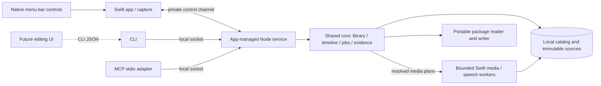

# Recording for AI — personal release spec

Status: spec complete; implementation partial. Last updated: 2026-09-15.
Bootstrap build/conformance and actual-agent image access are verified. The pure
timeline engine passes focused tests and independent review. Native capture,
speech preparation and revision storage have work in progress; the personal
release and its end-to-end acceptance gates are not complete.

## Next Agent Prompt

You are implementing the personal Mac release. Read this spec, its
[contracts](contracts.md), [architecture](architecture.md), and
[verification](verification.md), then resume from the current pickup below.
Honor the product decisions in the [discovery map](MAP.md); this spec resolves its
technical OPEN entries through concrete contracts or named gated slices.

Use Bun workspaces and the factory/photoctl monorepo pattern. Keep native capture
and media execution in Swift, and shared library/edit/timeline behavior in one
TypeScript core. CLI and MCP expose the same full operation registry. The future
editing UI calls the CLI.

Work through dependency-ready slices, committing focused green checkpoints when
a repository is initialized for implementation. Do not invent a remote, push target
or distribution step. Collect real native, speech and client evidence: a protocol
mock is not an image-visibility result, and an untested ASR engine is not a solution
to removing fillers. If a feasibility gate fails, reslice its bounded alternative;
do not quietly reduce scope. Continue independent work while an actual user
recording or permission is pending, but do not call that gate passed.

Update this section and the owning slice before ending each implementation pass:
completed work, exact next pickup, evidence paths, failures and delegated decisions.
Current pickup: resolve the reviewed native finalization issue and finish crash
recovery, then connect the app-managed service. Socket transport and native frame
decoding are independent active subpasses. Timeline/revision storage, speech probe
plumbing and the localhost workbench are integrated. Human transcription fidelity,
all-source/audio capture and native menu interaction remain unverified. Consult
owning slices before recreating work or accepting a downstream assumption.

Evidence: [bootstrap](assets/bootstrap/verification.md),
[actual-agent images](assets/client-image/review.md),
[native capture checkpoint](assets/capture/review.md),
[speech gate](slices/04-local-speech-gate.md),
[workbench](assets/workbench/review.md).

- [ ] [00 — Workspace and runnable native harness](slices/00-workspace.md)
- [x] [00b — Real-agent image access](slices/00b-client-image-probe.md)
- [ ] [01 — Native capture and separate audio](slices/01-native-capture.md)
- [ ] [02 — Recover interrupted source media](slices/02-interruption-recovery.md)
- [ ] [03 — Cursor positions in captured coordinates](slices/03-cursor-geometry.md)
- [ ] [04 — Select a verbatim local speech engine](slices/04-local-speech-gate.md)
- [x] [05 — Pure non-destructive timeline engine](slices/05-timeline-and-revisions.md)
- [ ] [06 — Single-writer library and app-managed service](slices/06-service-and-jobs.md)
  - [x] [06a — Durable revision transactions](slices/06a-revision-store.md) (independent after 05)
  - [ ] [06b — Bounded local transport](slices/06b-local-transport.md) (independent after 00)
- [ ] [07 — Usable menu-bar recording controls](slices/07-menu-bar-controls.md)
- [ ] [08 — Durable local transcription and projections](slices/08-transcript-processing.md)
- [ ] [09 — Arbitrary clean frames and media excerpts](slices/09-frame-inspection.md)
  - [ ] [09a — Native kept-interval frame decoding](slices/09a-native-frame-decode.md) (independent after 00)
- [ ] [10 — Readable cursor trails on requested frames](slices/10-cursor-trails.md)
- [ ] [11 — Useful bounded screenshot index](slices/11-screenshot-selection.md)
- [ ] [12 — Complete CLI/MCP inspection and editing](slices/12-cli-mcp-operations.md)
- [ ] [13 — Playable edited media and audio joins](slices/13-edited-media.md)
- [ ] [14 — Two exports and relocated AI inspection](slices/14-exports-and-package-reader.md)
- [ ] [15 — Installed personal workflow and closeout](slices/15-personal-release.md)

## Outcome

Record a narrated website demonstration on localhost, then tell an external coding
agent to inspect the latest recording. It reads word-timed narration and a screenshot
index, requests images/audio at useful moments, and uses cursor trails to understand
what was pointed at. It can trim or cut specified ranges, undo, and inspect or export
the edited result.

“Cut out the ums” and “cut out the part where I said this is free” are external-agent
workflows over evidence and explicit edit operations. The app contains local speech
recognition but no assistant, semantic editing model, rewriting or summarization.
The original recording and non-destructive history remain intact.

## Settled scope

- macOS menu-bar app; display/window/region capture, microphone narration and optional
  separately captured system/browser audio. All system audio is the initial filter;
  source selection does not imply browser-tab sound isolation.
- Start, stop, cancel, pause/resume and restart through native controls/shortcuts
  and machine operations. Pauses omit media time but add explicit elapsed-pause markers.
- Local English transcription with words, fillers/repetitions and timestamps.
- Clean source media plus raw cursor history; default two-second fading trail on
  inspection images, reset at pause/cut/scene/geometry boundaries; optional clean frames.
- Visual-change/coverage/cursor-aware screenshot index; arbitrary frame, crop,
  transcript, timeline, cursor and audio inspection.
- Latest discovers the newest take immediately, even before artifacts are ready.
  Separate readiness/failure/retry states let the caller wait and request again.
- Full CLI/MCP trim, batch cut, history, undo and restore. Revision-bound writes
  reject stale edits. Current/historical reads and exports pin a revision.
- Exactly two exports: playable human video, and the complete processed AI package
  including original media, source data, edits and current evidence. Package reader
  supports new frame requests after relocation.
- Preserve partial recordings honestly after interruption. Keep data until manually
  deleted; expose storage usage. Optimize short pointers and 2–5 minute walkthroughs,
  with bounded paged access to longer recordings.
- Personal host first. No drawings, webcam, editing timeline GUI, live AI streaming,
  cloud transcription, remote MCP, hosted sharing, accounts, public updater,
  speculative platform support, or general video effects in this release.

## Architecture in one view

[Architecture](architecture.md) names every owner, process lifetime and package.
[Contracts](contracts.md) specifies units, schema fields, operations, partial words,
pause/cut events, limits, request replay, audio mix and export semantics.
[Research](research.md) records actual SDK/reference evidence and the three-draft synthesis.

## Slice ladder and review surfaces

| Slice | Depends on | Review surface |
| --- | --- | --- |
| [00 Workspace and native harness](slices/00-workspace.md) | None | Local .app launch and protocol round trip |
| [00b Real-agent image access](slices/00b-client-image-probe.md) | 00 | Actual agent MCP/CLI image read |
| [01 Native capture and separate audio](slices/01-native-capture.md) | 00 | Three capture sources + isolated audio playback |
| [02 Recover interrupted source media](slices/02-interruption-recovery.md) | 01 | Killed writer, decoded recovered prefix |
| [03 Cursor positions in captured coordinates](slices/03-cursor-geometry.md) | 01 | Asymmetric grid and cursor error |
| [04 Select a verbatim local speech engine](slices/04-local-speech-gate.md) | 00 | Real narration, filler ledger, audible cuts |
| [05 Pure non-destructive timeline engine](slices/05-timeline-and-revisions.md) | 00 | Expected source spans and revision examples |
| [06a Durable revision transactions](slices/06a-revision-store.md) | 05 | Real SQLite replay, undo and competing writers |
| [06b Bounded local transport](slices/06b-local-transport.md) | 00, 06a for edit fixture | Real socket calls and bounded failure |
| [06 Single-writer library and app-managed service](slices/06-service-and-jobs.md) | 02, 05 | Real-process state/race/restart cases |
| [07 Usable menu-bar recording controls](slices/07-menu-bar-controls.md) | 03, 06 | Native controls and recording state shots |
| [08 Durable local transcription and projections](slices/08-transcript-processing.md) | 04, 06 | Word-timed transcript and retry |
| [09 Arbitrary clean frames and media excerpts](slices/09-frame-inspection.md) | 03, 05, 06 | Timestamped clean frames/audio |
| [10 Readable cursor trails on requested frames](slices/10-cursor-trails.md) | 09 | Circle/wave and boundary trail shots |
| [11 Useful bounded screenshot index](slices/11-screenshot-selection.md) | 10 | Contact sheet with selection reasons |
| [12 Complete CLI/MCP inspection and editing](slices/12-cli-mcp-operations.md) | 00b, 07, 08, 11 | CLI/MCP parity and actual agent edit calls |
| [13 Playable edited media and audio joins](slices/13-edited-media.md) | 09, 12 | Audition/inspect actual edited media |
| [14 Two exports and relocated AI inspection](slices/14-exports-and-package-reader.md) | 08, 11, 13 | Two exports; moved package, new frame |
| [15 Installed personal workflow and closeout](slices/15-personal-release.md) | 00–14 | Installed localhost journey and closeout |

Slices 00b, 01, 04 and 05 can progress independently after bootstrap; pending
client login in 00b does not block the other probes. Recovery follows
capture; geometry is judged separately. Image transport is proved early using a
fixture; the full AI edit journey waits for actual edit operations and media output.
No slice may declare a downstream contract complete using an upstream failed probe.

## Risk decisions before mechanical work

1. **Speech fidelity:** compare Parakeet and Whisper through real local runtimes.
   One engine ships; if neither passes filler/timing requirements, slice 04 owns a
   bounded alternative, not a model-picker detour.
2. **Recoverable media:** try native fragmented files before custom segmented
   storage. Slice 02 chooses from observed interruption behavior.
3. **Cursor geometry:** native metadata owns coordinate transforms. Slice 03 must
   prove moved-window and region behavior; later overlays cannot mask a bad transform.
4. **Scene/index policy:** deterministic heuristics with measured fixture outcomes.
   Slice 11 can tune thresholds, but cannot suppress cursor-only emphasis.
5. **Actual consumer:** use the installed Claude Code CLI with isolated session
   configuration as the first concrete agent. A second client is future coverage.
6. **Fresh formats:** plan version 1 without migration/backward-compatibility machinery.
   Existing user recording data from another app was not requested for import.
7. **Package semantics:** preserve originals and edit history, label source/edited
   coordinates, export a pinned revision, and reopen with the same inspector.

The named engine, recovery, geometry, app/service lifecycle and actual-client checks
are explicit feasibility gates that may require technical reslicing. They never
authorize silently changing product scope. Other user-visible defaults are specified
in contracts, not left as guesses.

## Review and quality gates

Use [verification](verification.md) throughout. Every visual slice explicitly runs
unprimed screenshot-critique last; comparisons against references/prior frames use
compare-screenshots first. Native controls, geometry, trail styling, and frame
selection have separate review surfaces. Human visual checkpoints are non-blocking
for reversible choices; missing capture permission or actual narration is not
inferred from silence.

Use narrow tests during iteration and the broad local gate once at final closeout.
Substantive implementation receives code-review and a codex second opinion under
their skills. The spec itself has undergone independent draft synthesis, recursive
fog splitting, ownership review and link/contract review; these do not replace
future implementation testing.

## Spec maintenance and handoff

The [map](MAP.md) preserves user decisions and discovery evidence; its old OPEN
checklist and kickoff prompt are superseded by this spec. Keep it as rationale, not
a competing task list. A new discovery updates the relevant contract/slice and this
handoff; record changed user-visible choices in an implementation choices ledger.
No file may carry instructions to implement an abandoned architecture.

Implementation-only discretion: internal algorithms/names and reversible styling
within a slice's explicit acceptance tests. Undeclared new capability, incompatible
format, second owner, or altered product scope is a spec gap to resolve, not
permission for an implementer to guess.

When all gates ship, use close-spec to turn the plan into durable rationale. Future
work stays in the existing placeholders:
[tester release](../tester-release/README.md),
[public release](../public-release/README.md),
[editing UI](../editing-ui/README.md).
