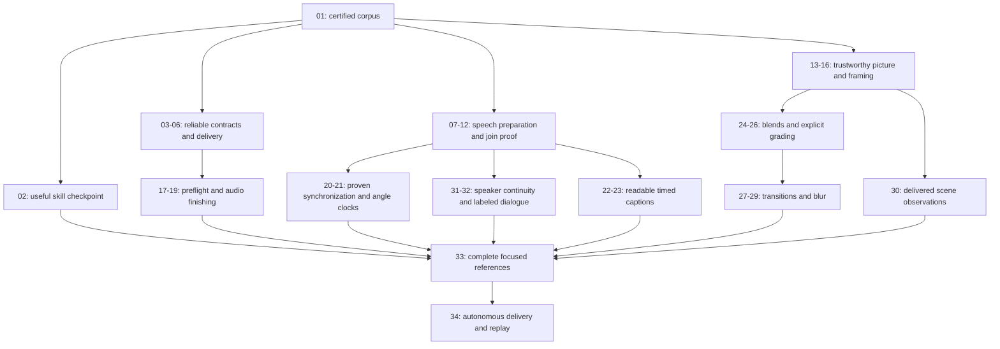

# Reliable autonomous video editing

Status: implementation active; core contracts through19 are integrated, synchronization and speaker quality gates remain open, and caption layout is in its first native checkpoint. Last updated: 2026-10-06.

Yap supplies explicit editing primitives and reproducible observations. The consumer
agent chooses the story, uses available creative tools, checks actual output and
repairs defects without asking a person to perform QA. This plan improves that
contract using the real trailer project's [complete feedback](FEEDBACK.md) and
[Claude-session retrospective](retro.md).

## Next Agent Prompt

Implement this spec on branch `spec/video-editing-feedback` in
`/Users/server/dev/yap-video-editing`. Keep tests in isolated managed state; no
merge, push or installed-app change has been requested. Hard cutover remains
binding: no aliases, dual readers or migrations; preserve external originals and
frozen historical evidence.

Current pickup: continue selected prepared project-tap alignment in10B2, then close
the native caption decoration stage22B. The20 waveform research is retained but all
nine real comparisons refuse its frozen acoustic gates, so lexical anchors remain
open. Reviewed atomic export, delivered picture observations, bounded alignment,
retained source portability, face observations and native-cache research are
integrated; the distinct speaker provider remains research-only until its quality
gates pass.

Completed: 02, 03, 04, 05, 06, 07, 08, 09, 13, 14, 17, 18, 19. Partial01 has exact source-rate PCM,
full-raster picture inputs and all five frozen07 original/derivative speech
comparisons. Multicamera/speaker controls and remaining behavioral certification
stay open.08's separate20s/4s ownership recipe is accepted; historical public/native
callers now prepare sources explicitly, and CLI waiting pins the admitted attempt.
[Evidence assets](assets/README.md) locate detailed scopes and failures.

[31 — speaker replication](slices/31-speaker-continuity-replication.md) is red:
the fixed hysteresis candidate passes short fixtures and the336s three-speaker
interview, but ten-minute four-speaker overlap remains57.49%, below the unchanged
80% gate. No provider or long-form envelope is promoted. Continue a justified
new provider hypothesis through short quality → continuity → sealed runtime → word
attribution; never promote a failed provider into32.10 must preserve accepted
NeMo CTC outputs and share correspondence/PCM owners; 10A default runtime acquisition is verified, including inherited077 preparation;
10B still owns retained public source/project alignment and acoustic boundaries.

Prepare/download pinned first-class Yap models/runtime as needed by default;
recommend external capabilities only when the brief warrants them. Ordinary
inference stays offline. Follow actual slice dependencies; unrelated structural
work need not wait for whole-corpus acceptance. Frozen research remains distinct
from product operations. Keep [traceability](traceability.md), [choices](choices.md)
and slice verdicts current. Narrow checks per pass; full suite once at completion.
No human QA or sign-off dependency.

## Global TODO and review map

Each checkbox is an independently verifiable contract, not a required separate PR.
Consecutive small steps can land together when their verdicts remain independent.
Numbering is a review order; actual prerequisites live in the slice headers.

- [ ] [01 — Certify real fixtures and independent controls](slices/01-certified-corpus.md)
- [x] [02 — Discover capabilities and make helper examples usable](slices/02-capability-first-skill.md)
- [x] [03 — Unify asynchronous public replies](slices/03-published-work-contract.md)
- [x] [04 — Bounded wait and ordinary JSON/artifact delivery](slices/04-wait-and-json-delivery.md)
- [x] [05 — Atomic replacement of owned exports](slices/05-atomic-export-replacement.md)
- [x] [06 — Exact rational remove ranges](slices/06-exact-removal.md)
- [x] [07 — Honest overlapping/instant speech observations](slices/07-speech-timing-admission.md)
- [x] [08 — Explicit bounded transcript preparation](slices/08-bounded-speech-preparation.md)
- [x] [09 — Local alignment feasibility and frozen reference](slices/09-alignment-replication.md)
- [ ] [10 — Alignment and acoustic boundary evidence](slices/10-alignment-and-boundaries.md)
- [ ] [11 — Speech recognition of actual revision audio](slices/11-rendered-speech.md)
- [ ] [12 — Contextual join verification and agent repair](slices/12-contextual-join-verification.md)
- [x] [13 — Decoded-picture replication](slices/13-decode-replication.md)
- [x] [14 — Objective picture observations](slices/14-picture-statistics.md)
- [ ] [15 — Face localization and explicit tracks](slices/15-face-observations.md)
- [ ] [16 — Constrained subject framing](slices/16-subject-reframe.md)
- [x] [17 — Audio-only normalization preflight](slices/17-normalization-preflight.md)
- [x] [18 — Strict, reliable dynamic mastering](slices/18-reliable-mastering.md)
- [x] [19 — Dialogue matching and compressor makeup](slices/19-dialogue-matching.md)
- [ ] [20 — Synchronization feasibility](slices/20-sync-replication.md)
- [ ] [21 — Declared angle clocks](slices/21-synced-angles.md)
- [ ] [22 — Native typography and caption styling](slices/22-styled-text.md)
- [ ] [23 — Timed word highlighting and entrance motion](slices/23-timed-word-captions.md)
- [ ] [24 — Explicit blend semantics](slices/24-blend-modes.md)
- [ ] [25 — Tone and color controls](slices/25-tone-controls.md)
- [ ] [26 — Immutable imported LUTs](slices/26-immutable-luts.md)
- [ ] [27 — Crossfade, dip and flash recipes](slices/27-basic-transitions.md)
- [ ] [28 — Whip/zoom trajectory and coverage](slices/28-whip-zoom-trajectory.md)
- [ ] [29 — Bounded motion blur](slices/29-motion-blur.md)
- [ ] [30 — Scene observations from delivered pixels](slices/30-delivered-scenes.md)
- [ ] [31 — Speaker continuity and attribution replication](slices/31-speaker-continuity-replication.md)
- [ ] [32 — Public speaker labeling and transcript views](slices/32-speaker-labeling.md)
- [ ] [33 — Focused launch, podcast and teaser references](slices/33-editing-references.md)
- [ ] [34 — Fresh-agent delivery and clean-state reproduction](slices/34-autonomous-trailer-acceptance.md)

## Outcome and boundaries

The acceptance workflow is: discover capabilities → understand complete exchanges
and references → assemble raw synced sources → finish picture, sound and captions
→ automatically verify and repair → deliver reproducibly. A teaser may deliberately
end after a complete provocative question and withhold its answer; a full highlight
preserves the answer and qualifications. Use cases live in their own references.

The final fixture brief spans co-hosts, dialogue matching, readable styled captions,
speaker-labeled dialogue, subject framing, a deliberate transition and reference-conditioned grading. A fresh
agent must discover a planted speech defect and repair it using public operations.
Another clean managed state/root path must reproduce the checked output. This is a
development scenario using authorized fixture media, not a new user editing project.

No built-in editorial engine, automatic crop/grade/cut, named-person inference,
music/image generator, cloud ASR, bundled browser animation runtime or second EDL
renderer is proposed. External capabilities remain in the consumer workflow. Existing
alpha overlays and generated asset imports stay useful for advanced treatments.

Speaker labeling includes a mixed recording, not just naming per-person camera
files. Today's optional diarizer supplies anonymous invocation-local slots for
exactly 30 seconds; stable long-form IDs, word attribution and public display-name
bindings are missing. Slices 31–32 add them after measured continuity proof. Names
come from explicit caller bindings; unknown/overlapping speech stays honest.

The current reports must be reproduced before assigning bugs to today's product.
Already-shipped behavior becomes a regression-owned success. Proposed suggestions
such as dropping words, relaxing loudness tolerance or returning a failed master as
successful are not adopted: observations remain honest and requested postconditions
remain strict. The agent can explicitly revise an editorial treatment within its brief.

## Hard cutover and data reset

The user selected no backward compatibility. Ship one public contract per capability:
no old-field aliases, dual readers, compatibility shims, data migrations or version
negotiation. Old managed projects/transcript caches may be deleted when required by
changed formats; do not build a preservation path for them.

Before any reset, resolve the active managed-data root using its actual owner and
stop/drain its service. Limit deletion to that root's affected generated state. Do
not delete externally referenced source videos, the videos collection repository,
fixture inputs, supplied/generated creative assets needed for replay, or frozen
spec evidence. A reset cannot substitute for proving new retry/recovery behavior.
This planning pass performs no deletion.

## Single-owner invariants

- Protocol schemas own public input/output shapes. CLI, MCP and app adapters share
  operation handlers; each new app capability is also public CLI functionality.
- Core owns retained assets/evidence, revisions, jobs, models and publication.
  New preparation uses that lifecycle; waiting is an adapter behavior, not another
  worker scheduler. Measurement JSON uses delivery leases, not internal cache paths.
- Composition owns exact time and occurrence projection. Speech estimates may
  overlap; authored edits remain exact. Source, project, session and delivered-file
  clocks are distinct and have explicit mappings.
- Native media owns sample support, audio preparation, decoding and rendering.
  Preview/inspection/export use one recipe. Reference FFmpeg/Swift scripts are
  frozen comparators, not a production fallback renderer.
- Product detection supplies observations and constraints. Explicit caller edits
  own treatment; named subjects and angle clocks require explicit bindings.
- The consumer skill owns workflow guidance; task repositories own briefs,
  decisions, retained external assets and build recipes. Avoid a second editorial
  database or duplicated procedures across use-case references.

## Milestones and risk gates

This is a milestone view, not a replacement dependency graph. [Research](research.md)
defines the experiments and unsupported-provider caveats. [Planning choices](planning.md)
record alternatives from independent drafts and the reasons for this ladder.

## Verification policy

Follow repo `write-tests` before behavior changes. Use the narrowest real consumer
check that answers the slice's question, and reuse valid media/inference results.
Do not run the full suite per slice. Run it once when this spec's implementation is
finished; run it sooner only if the next work cannot be trusted without it. Keep
expensive checks asynchronous with progress, a bounded stop and retained failures.

Measure actual delivered audio/pixels, not just requested parameters. Coverage
reports distinguish observed frames/windows, missing support, detector failures
and excluded regions. Waveform energy does not label a word. ASR scores are not
calibrated probabilities. Histogram clipping is not proof of an incorrect grade,
and unchanged edit instructions are not proof of reproduced media.

For every visual slice, declare the one judged variable and crop/mask. Run
[compare-screenshots](../../.agents/skills/compare-screenshots/SKILL.md) against matched
before/reference/candidate output, inspect temporal artifacts when a still cannot
answer the question, then run unprimed
[screenshot-critique](../../.agents/skills/screenshot-critique/SKILL.md) as the last
visual acceptance check. Show useful shots with
[preview-shots](../../.agents/skills/preview-shots/SKILL.md). Viewing is for direction;
human QA, labeling, listening and sign-off are never required. Close preview windows
after showing them so unattended work does not accumulate windows.

The agent investigates discrepancies, performs bounded conservative repairs within
the brief, rechecks changed output and delivers its best checked candidate with
precise uncertainty. A failed required contract stays unfinished; uncertainty does
not turn it into a pass. Run scoped refactor-clean, code-review and write-docs before
calling a slice complete, and remove replaced owners immediately.

## Evidence and coverage

[Traceability](traceability.md) maps every numbered feedback item and chronological
user bullet to its owner and acceptance. [MAP.md](MAP.md) retains the completed
four-quadrant exploration, user decisions and remaining feasibility questions.
[The retrospective](retro.md) separates agent discoveries from user direction and
corrects overclaims about speech bias, frame coverage and reproduction.
[Fixtures](fixtures.md) define the authorized reduction policy and ~250 MB target.
[Frozen inputs](assets/README.md) carry source identities, session excerpts and
reference scripts. [Review](review.md) records this plan's checks and limits.

Planning evidence was frozen before implementation. Follow the live prompt above
for current implementation state; slice verdicts own the actual acceptance claims.
